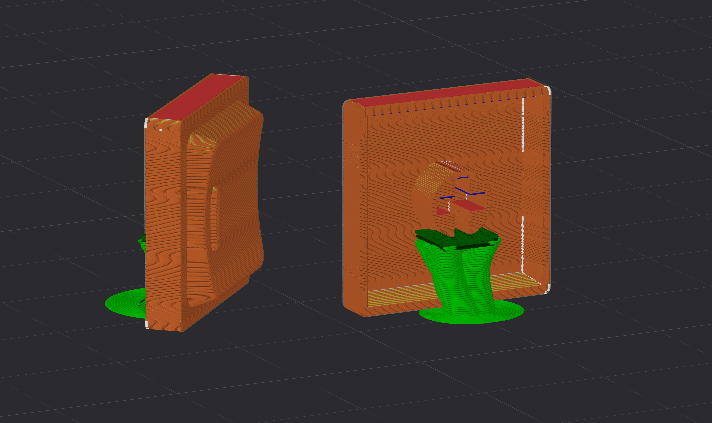

# キーキャップデータ

## LAK 17mmピッチ用

**サイズ:** W 16.2mm × D 16.2mm × H 約6mm

### 確認済みキースイッチ

- Kailh Deep Sea Silent Mini
- Lofree Hades / Void
- Kailh Black Cloud
- Kailh Purple Iris
  
### 印刷

#### 確認済み環境

| 項目 | 値 |
|------|----|
| プリンター | Bambu Lab A1 Mini |
| ノズル | 0.2mm |
| 品質 | Standard |

#### スライス例   

---

### 注記
このキーキャップは、LAKプロファイルにインスパイアされています。  
形状は異なる寸法で独自に再設計したものであり、Chosfoxのオリジナル設計ファイルは一切使用していません。

> ⚠️ 第三者の知的財産権に関する保証はありません。  
> 商用利用前に、各自で知的財産権の状況を確認してください。