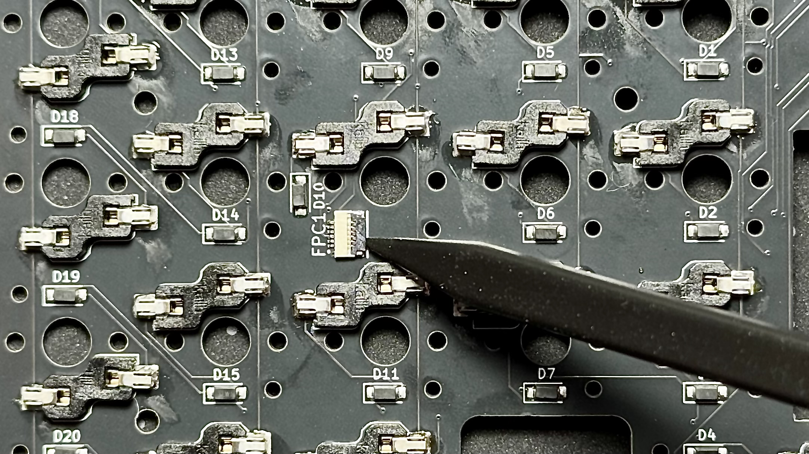
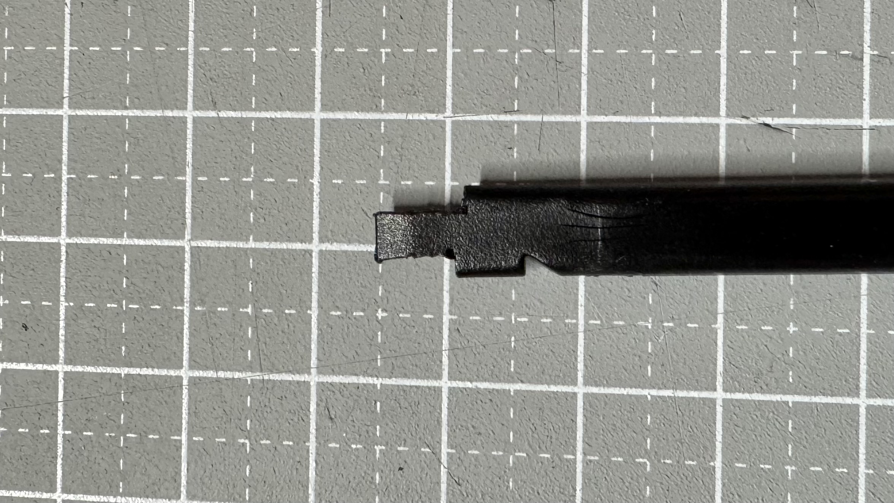
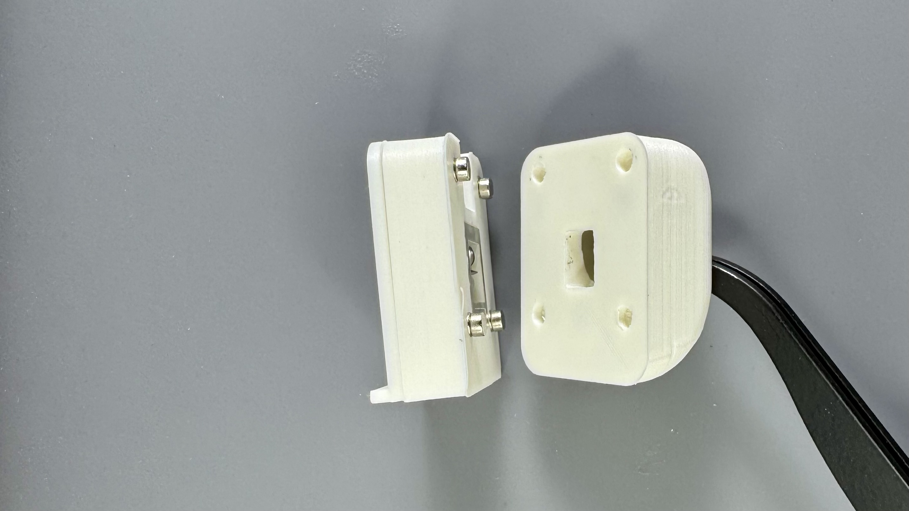

# LisM ビルドガイド

自作キーボード`LisM`のビルドガイドです。  
購入時に組み立てオプションがない・選択しなかった場合はご自身での組み立てが必要です。   
本ドキュメントを参照し、組み立ててください。

## 共通
本ドキュメント内では以下は都度説明を行いません。

- はんだ付けの際は、適宜フラックスや予備はんだを使用してください。
- FFCコネクタのフリップは壊れやすいのでご注意ください。  
    同梱のスパッジャーでの開閉をお勧めします。  
    { width="65%" }
- スパッジャーは、ニッパー等で画像の様に加工すると各モジュールのFFCコネクタのフリップを開閉しやすくなります。  
    { width="65%" }

- 本体とモジュールの接続はマグネットを使用しています。  
   印刷精度によっては緩い場合があるため、必要に応じて接着剤で固定してください。   
   接続する相手側にマグネットを配置し、ケースを軽く押し当てて仮止め後、机やスケール等を利用してしっかり押し込んでください。  
    { width="65%" }