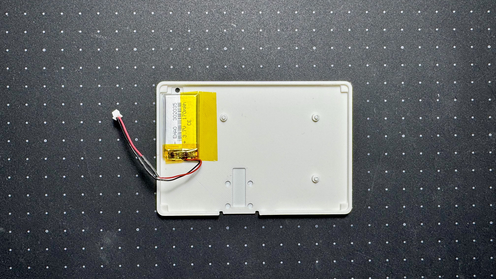

# LisM 本体 ビルドガイド

## はじめに

このドキュメントは、自作キーボードキット「LisM」の本体組み立て方を解説するビルドガイドです。  
組み立てを始める前に、内容物をご確認ください。

---

### キットの内容物
{ width="65%" }

| 部品名 | 数量 | 備考 |
| :--- | :--- | :--- |
| メイン基板 | 1 | |
| 電源スイッチ | 2 | MSK-12D19 |
| リセットスイッチ | 2 | SKQYACE010 |
| JSTコネクタ | 2 | 2p SMD Horizontal |
| JSTコネクタケーブル | 2 | 2p  |
| ソケット | 40 | Kailh Choc V1, V2用 |
| FFC (フレキシブルフラットケーブル) | 4 | 6pin 0.5mm Forward 10cm (2枚予備) |
| FFC (フレキシブルフラットケーブル) | 2 | 6pin 0.5mm Forward 5cm (予備) |
| マグネット | 8 | 3mm x 1mm |
| スパッジャー | 1 | FFCコネクタ用 |
| 紙ステンシル | 2 | XIAOリフロー用 (1枚予備) |

### ケース
{ width="65%" }

!!! note "ケースをご自身で用意される方は、[ケースデータ]({{three_d_data_url}}/case){:target="_blank"}の`LisM.step`をご使用ください。"
     

| 部品名 | モデル名 | 備考 |
| :--- | :--- | :--- |
| ボトムケース 左 | Left_BottomPart | |
| ボトムケース 右 | Right_BottomPart | |
| スイッチプレート 左 | Left_SwitchPlate | |
| スイッチプレート 右 | RightSwitchPlate | |
| トップケース 左 | Left_TopPart | |
| トップケース 右 | Right_TopPart | |
| 電源スイッチカバー | Left/Right_Switch | 左右共通 |

---

### 別途必要なもの

| 部品 | 数量 | 備考 |
| :--- | :--- | :--- |
| Seeed Studio XIAO nRF52840 | 2 | 組み立てOP2, 3, 4 を選択された方はキットに同梱 |
| 3.7Vリチウムポリマーバッテリー | 2 | 302035型 or 302030型を推奨  (組み立てOP4を選択された方はキットに同梱)|
| 収縮チューブ or ビニールテープ | 1 | JST1.25コネクタ付きのバッテリーをご用意された方は不要 |
| キースイッチ | 40 | Kailh Choc V1 または V2 |
| キーキャップ | 40 | 16.5mm x 16.5mm以下を推奨 |
| USB-C ケーブル | 1 | PCとの接続用 |
| 滑り止め | - | `+GRIPLUS+（グリップラス）`がオススメ |

---

### 必要な工具

*   はんだごて
*   はんだ
*   ピンセット
*   ニッパー
*   ドライバー (+)
*   やすり

**リフローを行う場合:**

| 工具名 | 備考 |
| :--- | :--- |
| はんだペースト | 低温で問題ないと思います([参考](https://amzn.asia/d/bFHorvf){:target="_blank"}) |
| はんだペースト用工具 | ヘラ、スキージー、プラスチックカードなど |
| ホットプレート | [私が使用している物](https://amzn.asia/d/01FeKOD){:target="_blank"} |

--- 

## 組み立て手順
!!! info "組み立てオプションに応じて必要な項目をご参照ください"

### 1. XIAOとJSTコネクタのリフロー

まず、メイン基板にXIAOとコネクタをリフローで取り付けます。  
コネクタは通常のはんだごてでも取り付け可能ですが、XIAOはリフロー必須です。

1.  付属の紙ステンシルを基板の指定の場所にテープなどでしっかりと固定します。  
    基板とステンシルの間に浮きがないように注意してください。  
    { width="65%" }
2.  ステンシルの上からヘラなどではんだペーストを塗布します。  
    (私は不要になったプラスチックカードを使用しています)  
    { width="65%" }  
3.  ステンシルをゆっくりと剥がし、XIAOとコネクタを所定の位置に載せます。  

    !!! tip "ブリッジしてしまった場合は、爪楊枝でブリッジ箇所のはんだを取り除いてください"
   
    { width="65%" }

4.  ホットプレートで加熱し、リフローを行います。  
    温度や時間は、使用するはんだペーストの仕様に従ってください。  
    { width="65%" }  

    !!! warning "ダイオードに当たらない様に注意してください"

### 2. 基板の切り離し
1. ペンチなどで折り、左右に分割してください。  
   固い場合は、カッターで軽く切り込みを入れると割りやすくなります。  
   { width="65%" }

1. 分割した部分をやすりで滑らかに整えてください。  
   { width="65%" }
   

### 3. 各種部品のはんだ付け

#### キーソケット
1. 基板のシルク（印字）に合わせて、すべてのソケットをはんだ付けします。  
   { width="65%" }

#### 電源スイッチ
1. マスキングテープなどで位置を固定し、裏側から足をはんだ付けします。  
   { width="65%" }
   
2. ケースと干渉するため、はんだ付け後にはみ出た足はニッパーでカットしてください。

#### リセットスイッチ
!!! info "XIAO上のリセットスイッチを使用する場合は取り付け不要です。"
    このスイッチを取り付けると、ケースを付けたまま底面からアクセスできます。

1. XIAOの裏`SW_REST1`へスイッチの両端をはんだ付けしてください。  
   { width="65%" }

### 4. バッテリーの準備
!!! info "ご用意いただいたバッテリーにJST 1.25 2pinコネクタが付いている場合、この作業は不要です"
    コネクタが付いていない場合は、付属のJSTコネクタケーブルをはんだ付けして準備します。  

!!! warning "バッテリーがショートしないように注意して作業してください"

1. 同梱のコネクタ付き配線を2cmくらいでカットして被覆を剥いてください。  
   { width="65%" }
2. (必要に応じて)予備はんだをつけてください。  
   { width="65%" }
3. 収縮チューブを通した後、バッテリーの配線とはんだ付けしてください。
   { width="65%" }  
4. 収縮チューブで絶縁してください。  
   配線の長さは合計で3cmくらいが理想です。  
   { width="65%" }

### 5. FFCケーブルの取り付け
!!! warning "FFCコネクタのフリップは壊れやすいのでご注意ください"

1. 10cmのFFCをコネクタへ取り付けてください。  
   (モジュールを固定で使用する場合は5cmのFFCを使用してもOKです。)  
    { width="65%" }

2. 画像のようにケーブルを折り曲げておくと、ケース内で取り回しがしやすくなります。    
    { width="65%" }

### 6. ケースの組み立て

1.  ボトムケースのモジュール部分にマグネットを取り付けます。  
   
    !!! warning "マグネットの極性に注意"
    
    スケール等を使用して押さえて取り付けてください。  
    印刷精度によっては緩い場合があるため、必要に応じて接着剤で固定してください。  
    { width="65%" }  
    { width="65%" }  
    { width="65%" }  
    { width="65%" }

2.  電源スイッチにスイッチカバーを取り付けます。  
    OFF側(手前側)に緑がくるように取り付けてください。  
    { width="65%" }
3.  ボトムケースにバッテリーを置きます。  
    必要に応じて両面テープで固定・キースイッチやキーソケットから保護してください。
    { width="65%" }
4.  組み立てた基板を載せ、バッテリーを接続します。  
    { width="65%" }

    !!! warning "電源OFF・極性確認！！"
        接続前に電源がOFFになっていること、  
        基板の印字`+`とバッテリーの`赤`線が接続されることを確認してください。  
        { width="65%" }

5.  スイッチプレートを載せます。  
    { width="65%" }
6.  トップケースを奥側からひっかけるようにして装着します。  
    { width="65%" }
   
7.  左右を少し広げながら、ゆっくりとボトムケースにはめ込みます。  
    (電源スイッチをONの位置にしておくと、作業しやすくなります)  

    !!! warning "広げすぎると割れるのでご注意ください"

    { width="65%" }

8.  最後に、手前のモジュール部分をしっかりと押さえて固定します。  
    { width="65%" }

### 7. FFCケーブル収納
1. 画像を参考に引き出しやすい折り方で収納してください。  
   { width="65%" }
   { width="65%" }
   

### 8. 仕上げ
お好みのキースイッチとキーキャップを取り付けて完成です。

---

## ファームウェアの書き込み
PCに接続してファームウェアを書き込みます。  
使用するモジュールに応じて、書き込むファームウェアが異なります。  
詳細は[`ファームウェア`](../firmware.md)を参照してください。