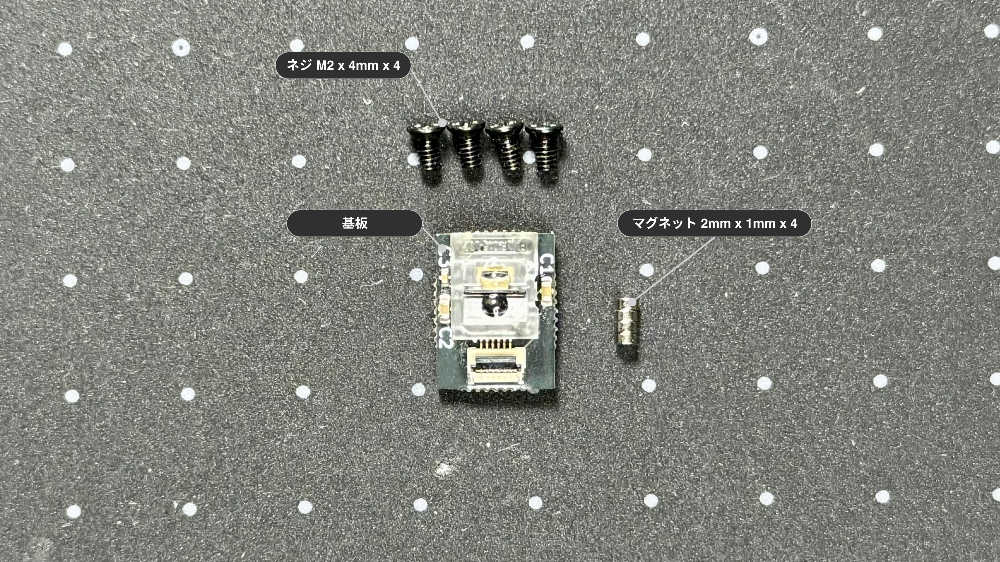
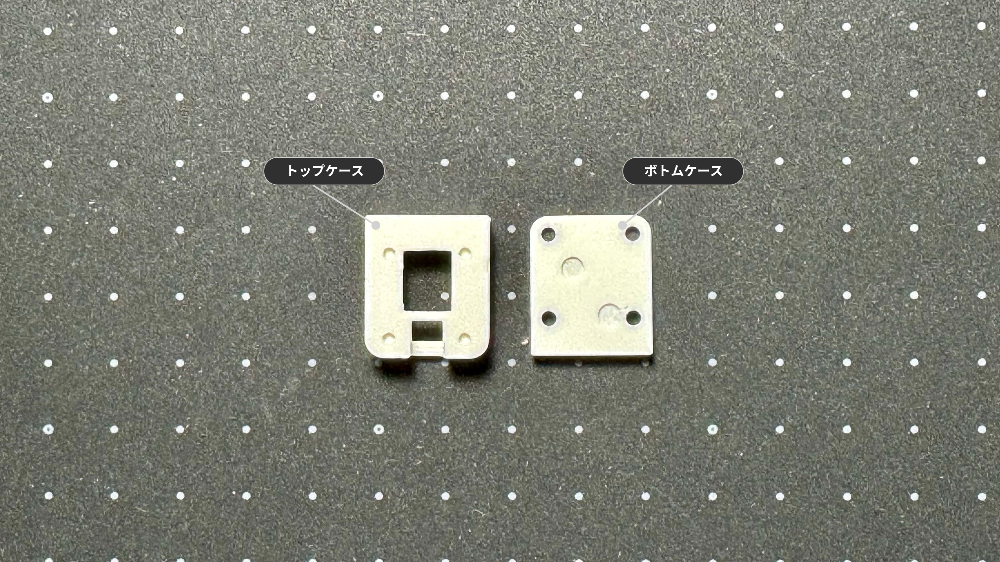
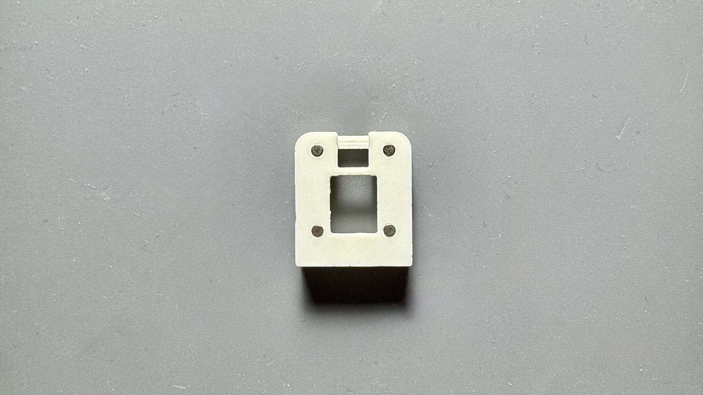
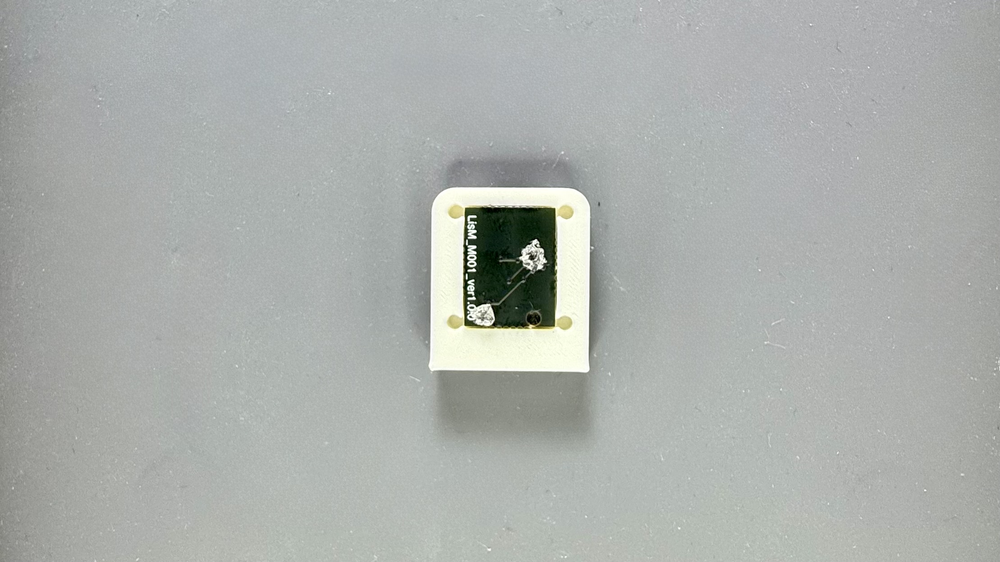
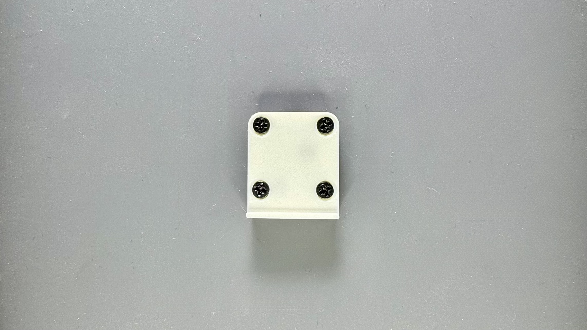
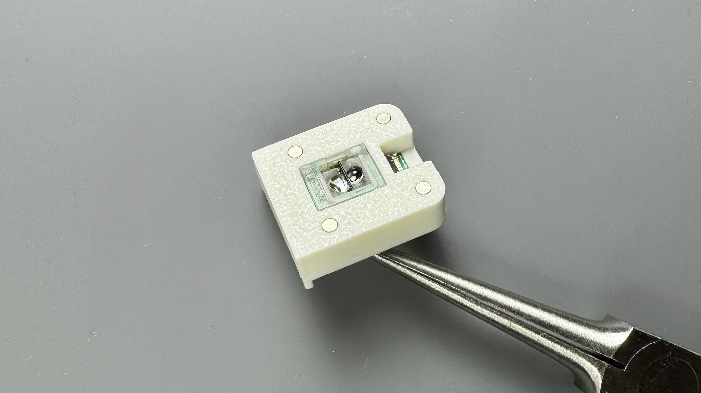
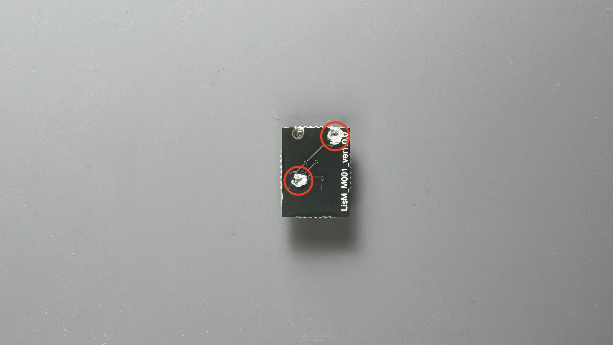

# トラックボールセンサーモジュール

## 概要

このモジュールは、1Uサイズのトラックボールセンサーです。  

## 内容物
{ width="65%" }

| 部品名 | 数量 | 備考 |
| :--- | :--- | :--- |
| 基板 | 1 | PAW3222搭載 |
| ネジ | 4 | M2 x 4mm |
| マグネット | 4 | 2mm x 1mm |

## ケース
{ width="65%" }

!!! note "ケースをご自身で用意される方は、[ケースデータ]({{three_d_data_url}}/case/modules){:target="_blank"}の`TrackBallSensor.step`を参照ください。"

| 部品名 | モデル名 | 備考 |
| :--- | :--- | :--- |
| トップケース | TopPart | |
| ボトムケース | BottomPart | |

## 組み立て手順

### 1. トップケースへマグネット取り付け
1. 4カ所へマグネットを取り付けてください。
   
    !!! warning "トラックボールユニットのマグネットの極性に合わせる必要があります"  
          
    { width="65%" }

### 2. ケース組み立て
1. FFCコネクタの位置を確認し、トップケースへ基板を入れてください。  
    { width="65%" }
     
2. ボトムケースをM2ネジで固定して完成です。(締め過ぎ注意)  
    { width="65%" }  
    { width="65%" }  

    !!! info "トップケースとボトムケースで隙間が空く場合"  
        基板裏面のレンズ固定箇所が干渉している可能性があります。  
        気になる方はニッパー等で切り、干渉を除去してください。(削りすぎ注意)   
        { width="65%" }  
