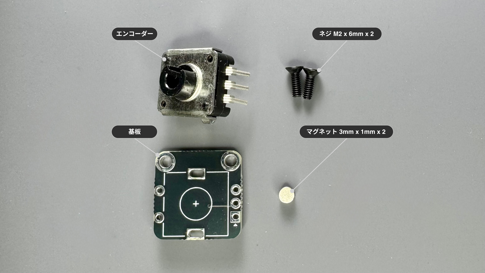
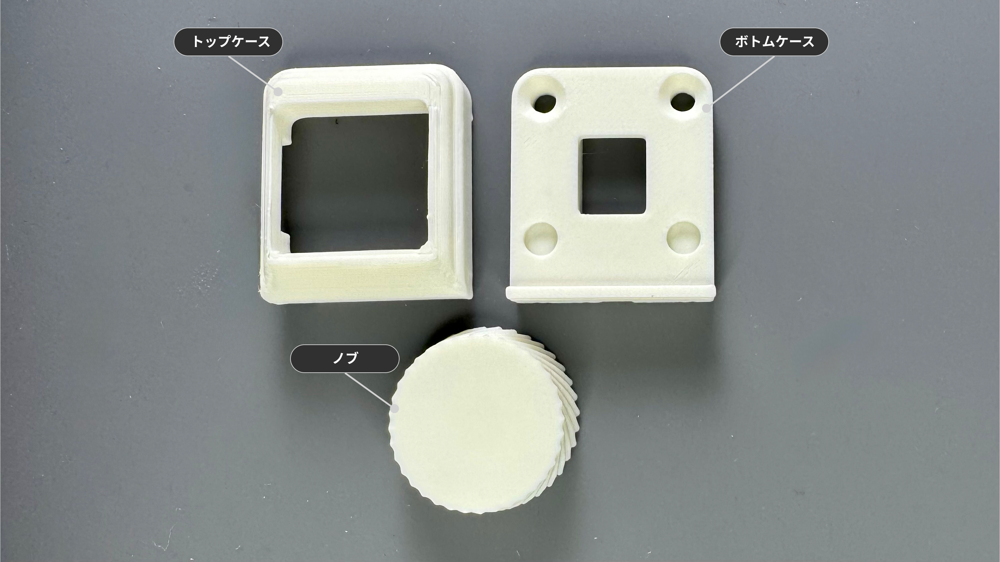
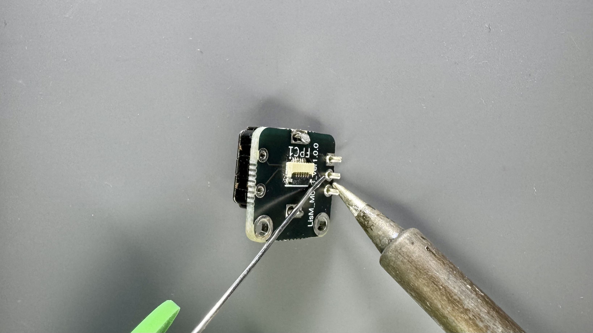
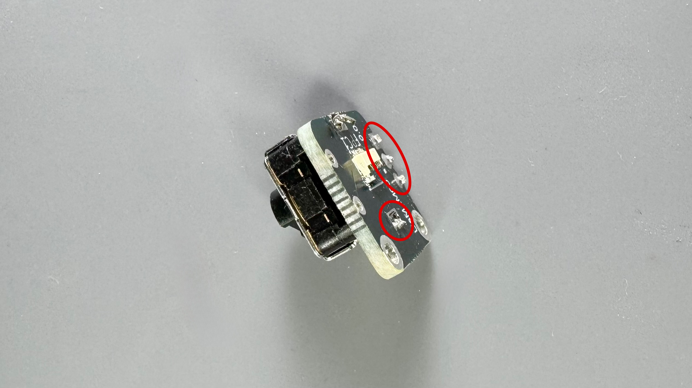
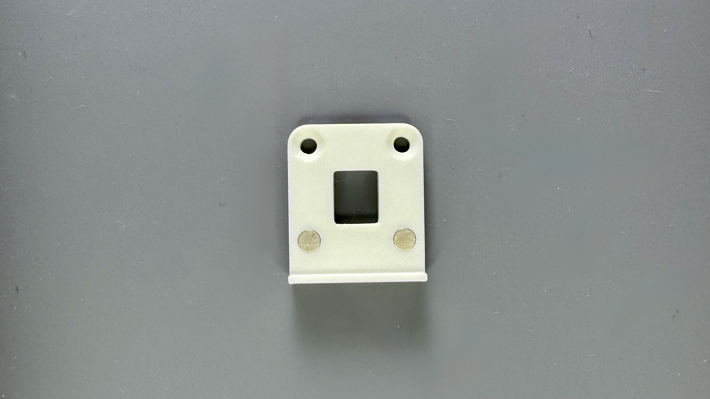
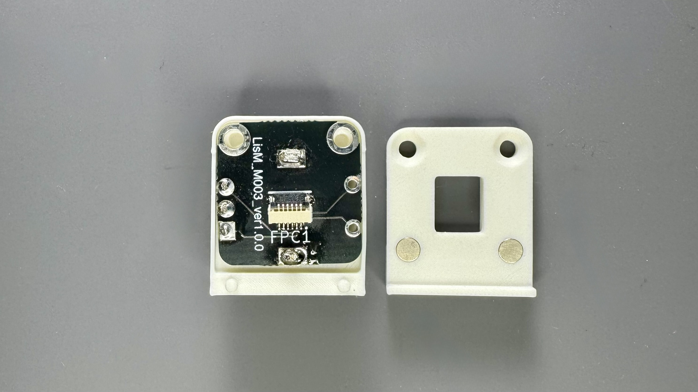
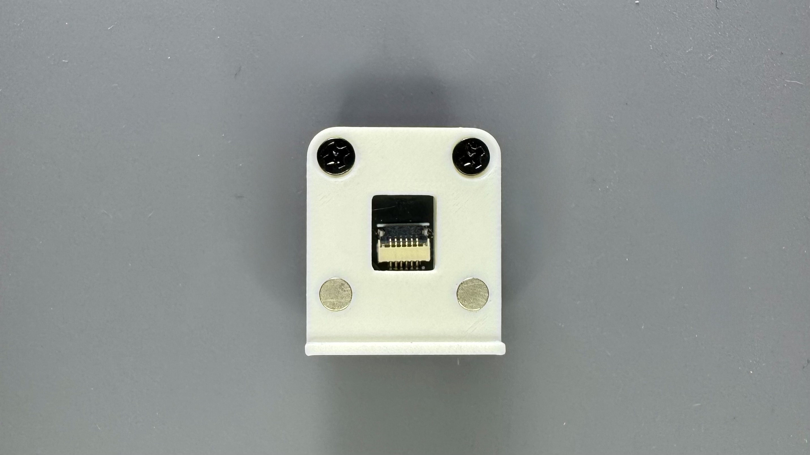
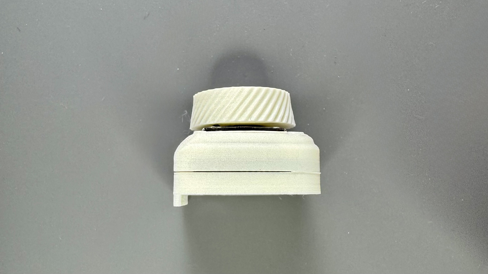
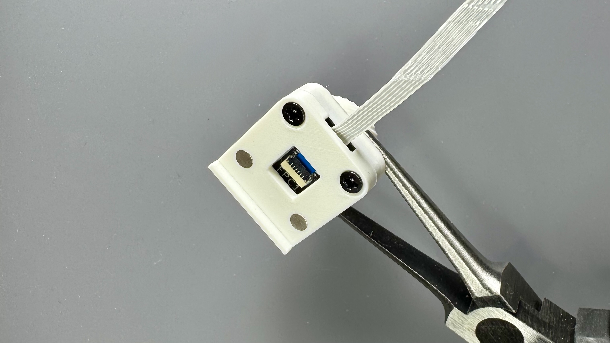

# 垂直ロータリーエンコーダーモジュール

## 概要

このモジュールは、1Uサイズの垂直ロータリーエンコーダーです。  
ロータリーエンコーダーは5pin（プッシュスイッチ）に対応していますが、同梱しているエンコーダーは3pinです。

## 内容物
{ width="65%" }

| 部品名 | 数量 | 備考 |
| :--- | :--- | :--- |
| 基板 | 1 | |
| エンコーダー | 1 | EC12E2440301 |
| ネジ | 2 | M2 x 6mm |
| マグネット | 2 | 3mm x 1mm |

## ケース
{ width="65%" }

!!! note "ケースをご自身で用意される方は、[ケースデータ]({{three_d_data_url}}/case/modules){:target="_blank"}の`VerticalRotaryEncoder.step`を参照ください。"

| 部品名 | モデル名 | 備考 |
| :--- | :--- | :--- |
| ノブ | Knob | |
| トップケース | TopPart | |
| ボトムケース | BottomPart | |

---

## 必要な工具

*   はんだごて
*   はんだ
*   ドライバー (+)
*   ニッパー

---

## 組み立て手順
### 1. はんだ付け

??? tip "エンコーダーの回転をスムーズにしたい方"  
    以下のポストのように部品を外すと力を入れずに回すことができるようになります。  
    <blockquote class="twitter-tweet">
ロータリーエンコーダーが回すのに結構トルク必要だったけど中の部品一つ外したらめっちゃ快適になった <a href="https://t.co/ILao7Msenr">pic.twitter.com/ILao7Msenr</a>
&mdash; shakupan (@shakupan_) <a href="https://twitter.com/shakupan_/status/1856025469663228051?ref_src=twsrc%5Etfw">November 11, 2024</a></blockquote> 

1. エンコーダーを基板に挿入し、はんだ付けを行ってください。  
    { width="65%" }
   
2. 画像の赤丸の足は、ケースやFFCを通す時に干渉するため、切断してください。  
   (切断してからはんだ付けでもOKですが、切り過ぎにはご注意ください)
    { width="65%" }

    !!! info "(推奨)FFCを保護するため、FFCが通る部分をテープ等で覆ってください。"  
        { width="65%" }

### 2. ボトムケースへマグネット取り付け
1. 底面(手前側)2カ所へマグネットを取り付けてください。
   
    !!! warning "本体のマグネットの極性に合わせる必要があります"  

    { width="65%" }

### 3. ケース組み立て
1. ネジ穴を合わせ、トップケースの中に基板を入れてください。
    { width="65%" }
   
2. ボトムケースの(奥側の)ネジ穴を合わせ、M2ネジで固定してください。(締め過ぎ注意)  
    { width="65%" }
   
3. ノブの向きを合わせながらエンコーダーに取り付けて完成です。  
    { width="65%" }

## 本体との接続時の注意事項
FFCはモジュールの奥側からケース内を通してコネクタと接続してください。  
{ width="65%" }

---

## 本体への取り付け
組み立てたモジュールは、[モジュール付け替えの手順](../../how2.md#モジュール付け替え)を参考に本体に取り付けてください。
