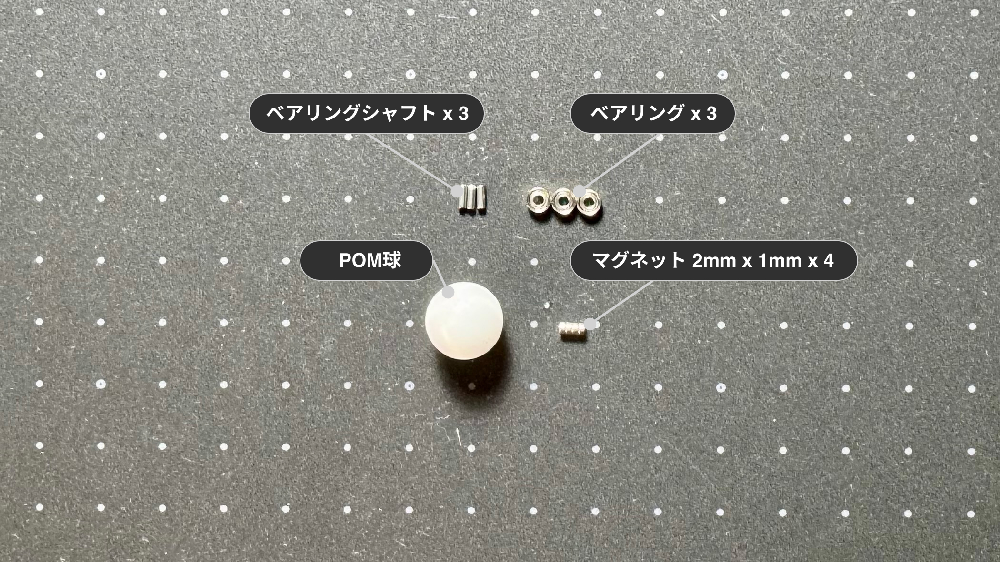
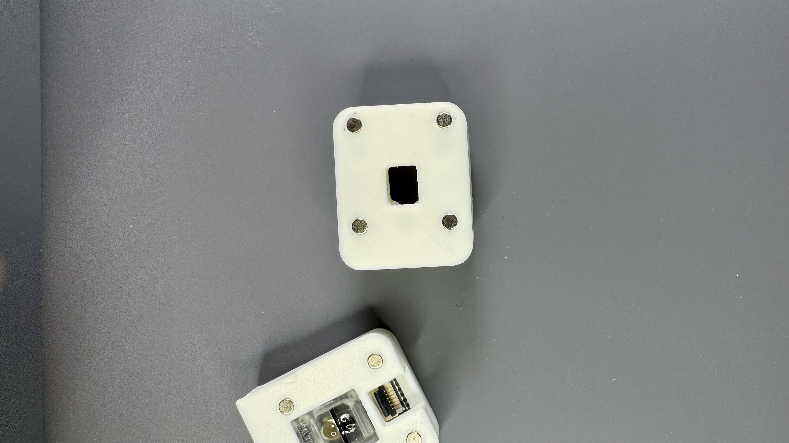
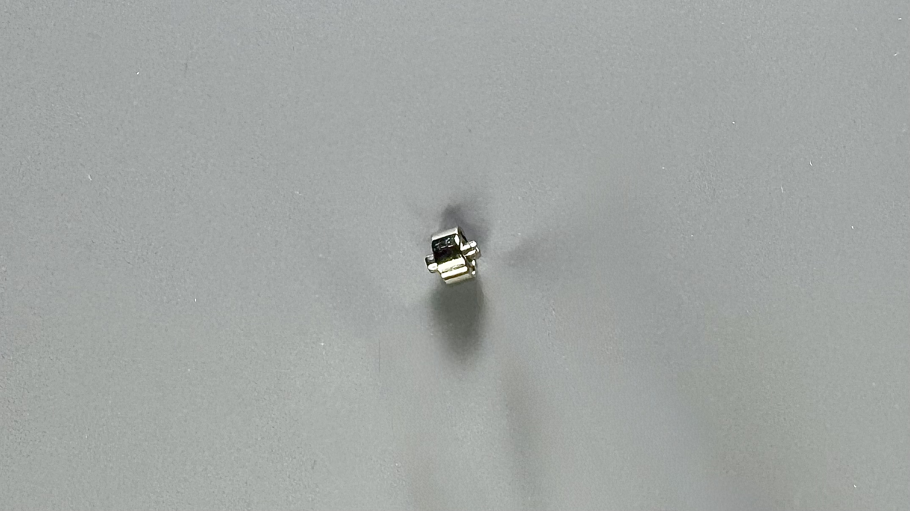
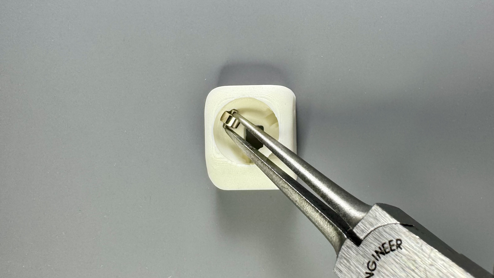
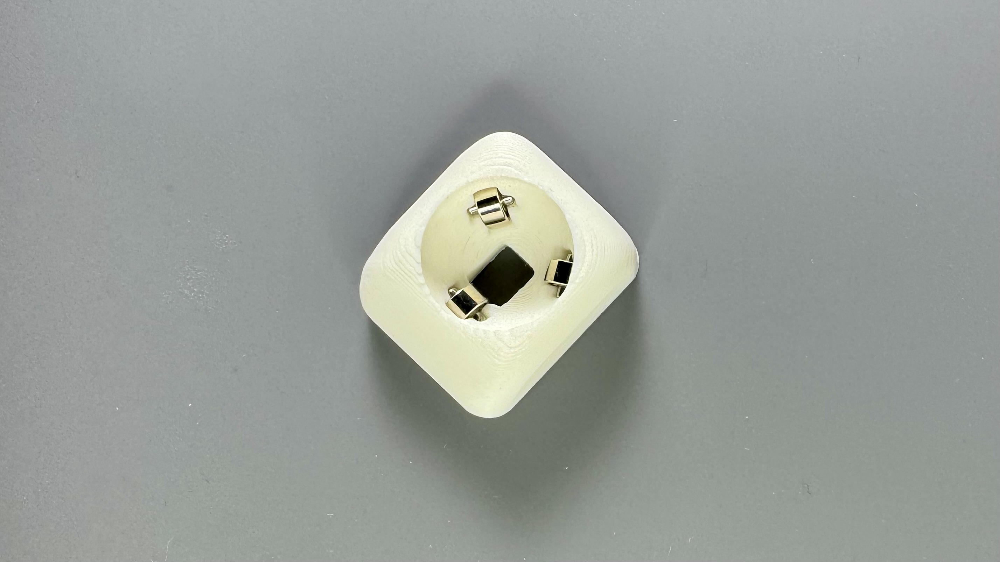

# トラックボールユニット(10, 12, 14mm) 

## 概要

このユニットは、10, 12, 14mmボールを使用したトラックボールです。

---

## 内容物
{ width="65%" }

| 部品名 | 数量 | 備考 |
| :--- | :--- | :--- |
| POM球 | 1 | 10 or 12 or 14mm |
| ベアリング | 3 | 1.5 x 4 x 2mm |
| ベアリングシャフト | 3 | 1.4mm x 4mm |
| マグネット | 4 | 2mm x 1mm |

## ケース
{ width="65%" }

!!! note "ケースをご自身で用意される方は、[ケースデータ]({{three_d_data_url}}/case/units){:target="_blank"}の`TrackBall(10 or 12 or 14)mm.step`をご使用ください。"

| 部品名 | モデル名 | 備考 |
| :--- | :--- | :--- |
| ケース | (10 or 12 or 14)mmCase | |

---

## 必要な工具

*   ピンセット or 先端が細いペンチ

---

## 組み立て手順
!!! note "ボールサイズによってケースの形状が多少異なりますが、どのサイズでも手順は同じです"

### 1. マグネット取り付け
1. 底面の4カ所へマグネットを取り付けてください。
   
    !!! warning "センサーモジュールのマグネットの極性に合わせる必要があります"  

    { width="65%" }

### 2. ベアリング取り付け
1. ベアリングへベアリングシャフトを挿入します。(3個)  
    { width="65%" }
   
2. 両端から同じ長さが出るように調整し、ケースの3カ所へ取り付けてください。  
   シャフトをピンセット等で押すと嵌ります。  

    !!! tip "最終的にボールで押し込まれるので、この時点で奥まで入れる必要はありません"  

    { width="65%" }  
    { width="65%" }

### 3. POM球取り付け
1. POM球を上から押し込んで完成です。  
    { width="65%" }