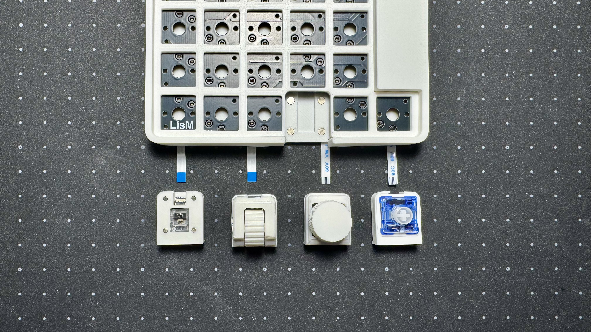

# 使い方

作成中...

## 電源ON/OFF

## 充電

## デバイスへの接続

## LEDインジケーター

## Bluetooth接続先変更

## リセット
接続がうまくいかない・モジュールが動かない場合などに使用します。

## モジュール付け替え

LisMは、用途に応じてモジュールを付け替えることができます。

1.  **電源をOFFにする**  
    安全のため、必ず左右両方の電源をOFFにしてください。

2.  **FFCケーブルを差し替える**  
    コネクタの黒いフリップを上げてケーブルを抜き、付け替えたいモジュールのケーブルを差し込みます。  
    フリップは壊れやすいので、付属のスパッジャーなどを使って慎重に操作してください。

    !!! tip "モジュールのFFCの向き"
        以下の画像の向きで接続してください。  
        

3.  **ファームウェアを書き換える**  
    使用するモジュールの構成に合わせて、適切なファームウェアを書き込む必要があります。  
    詳細は[ファームウェア](./firmware.md)を参照してください。

4.  **電源をONにする**  
    ファームウェアの書き込みが完了したら、電源をONにして動作を確認してください。

## キーマップ変更
キーマップの変更方法は、[ファームウェア](./firmware.md#キーマップの変更方法)のページを参照してください。

---