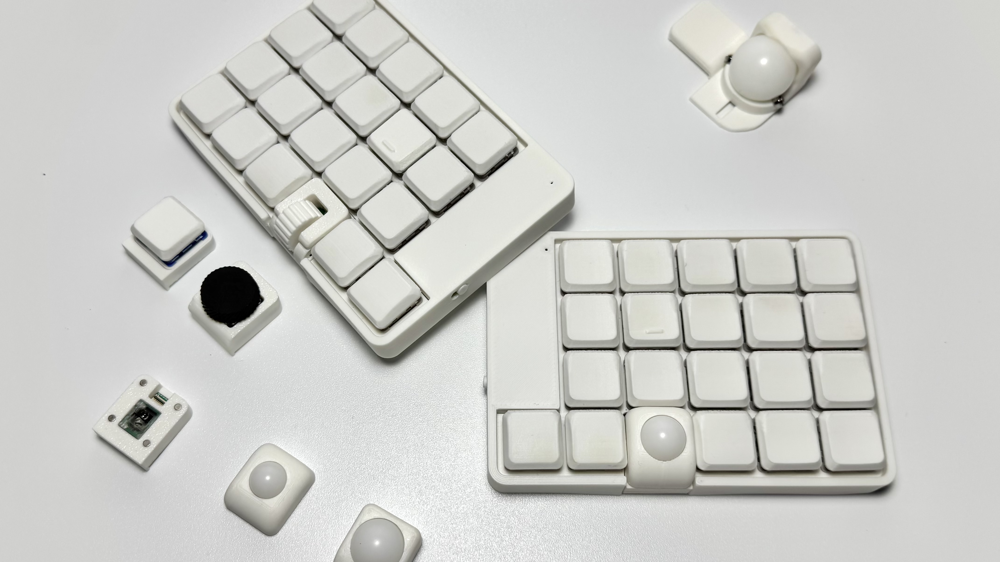

# LisM キーボード

`LisM`はモジュール式の分割キーボードで、左右それぞれの親指位置の1Uを異なるモジュールに交換できます。

## 特徴
- モジュール機構:  
  左右の親指部は、以下のモジュールに換装できます。  
    * トラックボール (10mm〜20mmまでご用意, PAW3222センサー)
    * 水平ロータリーエンコーダー (クリック付き)
    * 垂直ロータリーエンコーダー (5pin対応)
    * キースイッチ (ホットスワップ非対応)
- ネジレス構造のケース:  
  内部へのアクセスが容易でメンテナンスしやすい構造です。  
  (モジュールは一部ネジを使用しています)
- キー配列:  
  17mmピッチのオーソリニア（格子）配列です。  
  キー数は基本40個で、モジュール構成により最大42個まで使用できます。
- ファームウェア:  
  ZMKファームウェアに対応しており、キーマップを自由にカスタマイズできます。  
  (将来的にはRMKファームウェアの対応も検討中)

## 仕様
| 項目        | 仕様 |
| ---        | --- |
| キー数      | 40 (最大42) |
| 配列        | オーソリニア (17mmピッチ) |
| 対応スイッチ | Kailh Choc V1 / V2 |
| サイズ      | W: 109mm / D: 75.5mm / H: 16mm (キートップまで) |
| 重量        | 左右合計 約190g (14mmボール, 垂直エンコーダー構成時) |

## リンク
- [販売ページ](https://shop.4mple-lab.com/items/119269662){:target="_blank"}
- [ビルドガイド](build_guides/)
- [ファームウェア(個人設定)]({{firmware_config_url}}){:target="_blank"}
- [ファームウェア(ハードウェア構成)]({{firmware_keyboard_url}}){:target="_blank"}
- [3Dデータ]({{three_d_data_url}}){:target="_blank"}

### ファームウェアについて
詳細は[ファームウェア](./firmware.md)のページを参照してください。

## デフォルトキーマップ
Mac特化＆クセがすごいキーマップなので変更必須

