1Uサイズの`4wayスティック`モジュールのビルドガイドです。  

## 内容物
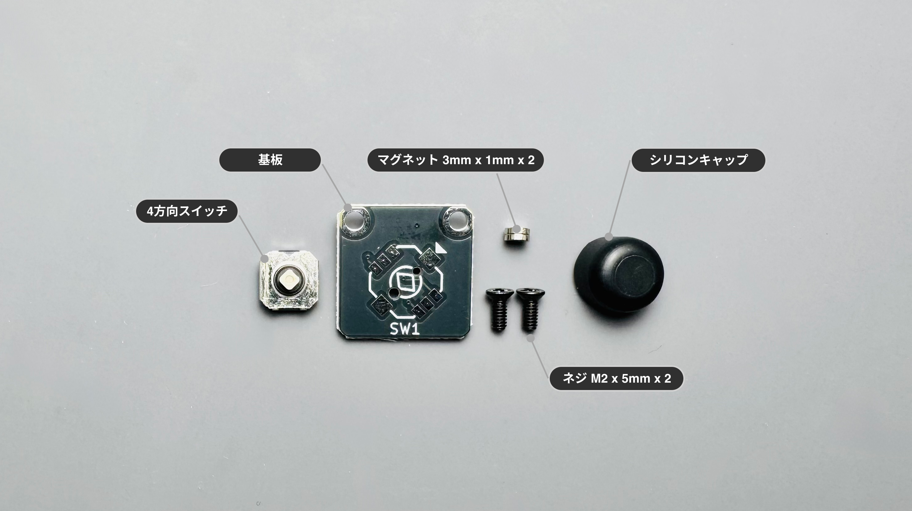

| 部品名 | 数量 | 備考 |
| :--- | :--- | :--- |
| 基板 | 1 | |
| 4wayスイッチ | 1 | SKRHADE010 |
| マグネット | 2 | N54 3mm x 1mm |
| ネジ | 2 | M2 x 5mm |
| シリコンキャップ | 1 | |

## ケース
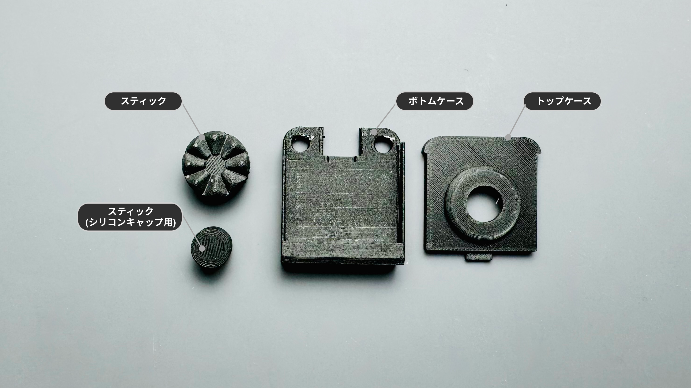

:::note[ケースをご自身で用意される方は]
[ケースデータ](https://github.com/4mplelab/LisM/tree/main/3d-data/case/modules)の`4WayStick.step`をご使用ください。
:::

| 部品名 | モデル名 | 備考 |
| :--- | :--- | :--- |
| スティック | Stick_Crown | |
| スティック(シリコンキャップ用) | Stick_Cap | |
| トップケース | TopPart | |
| ボトムケース | BottomPart | |

---

## 必要な工具

*   はんだごて
*   はんだ
*   ドライバー (+)

---

## 組み立て手順

### 1. はんだ付け
1. 基板の△マークとスイッチの切り欠きの向きを合わせて差し込み、8カ所はんだ付けをしてください。  
    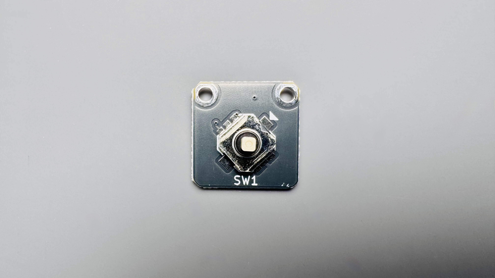
    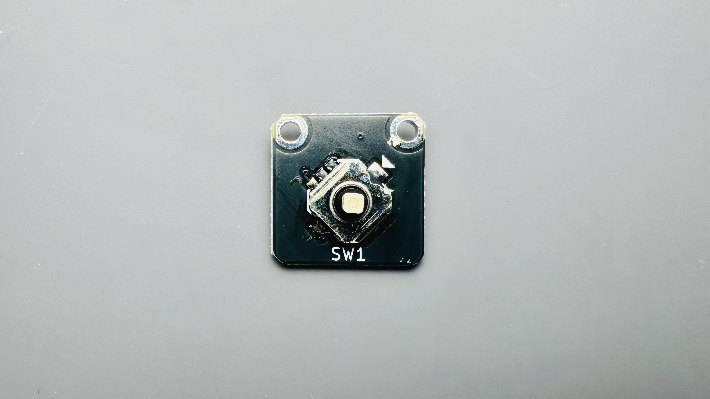

### 2. ボトムケースへマグネット取り付け
1. ボトムケース2カ所へマグネットを取り付けてください。

    :::caution[本体のマグネットの極性に合わせる必要があります]
    :::

    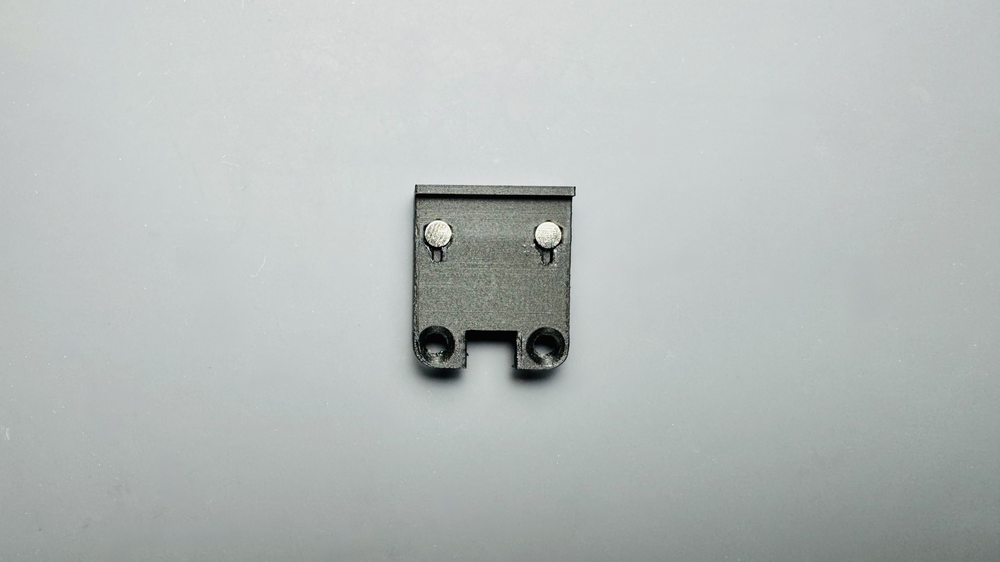

### 3. トップケースへ基板取り付け
1. トップケース裏の穴と基板のネジ穴が合う向きでトップケースを被せてください。  
    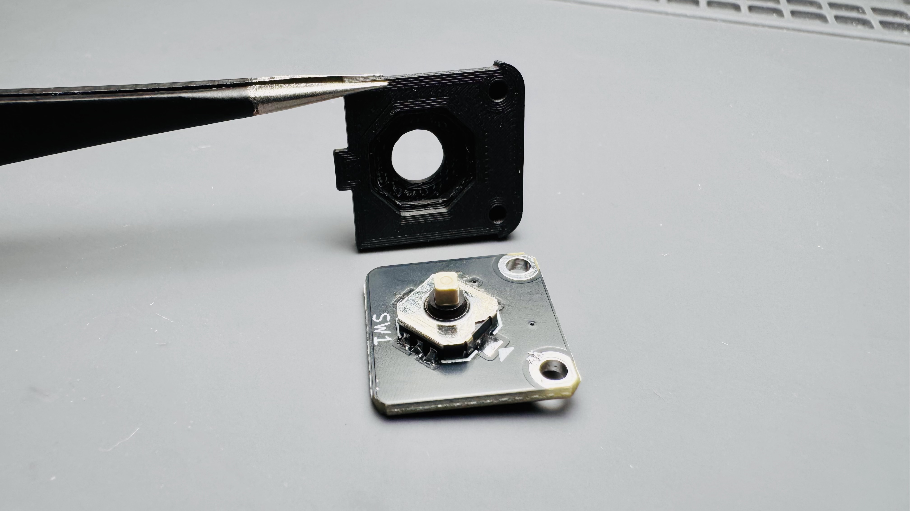  
    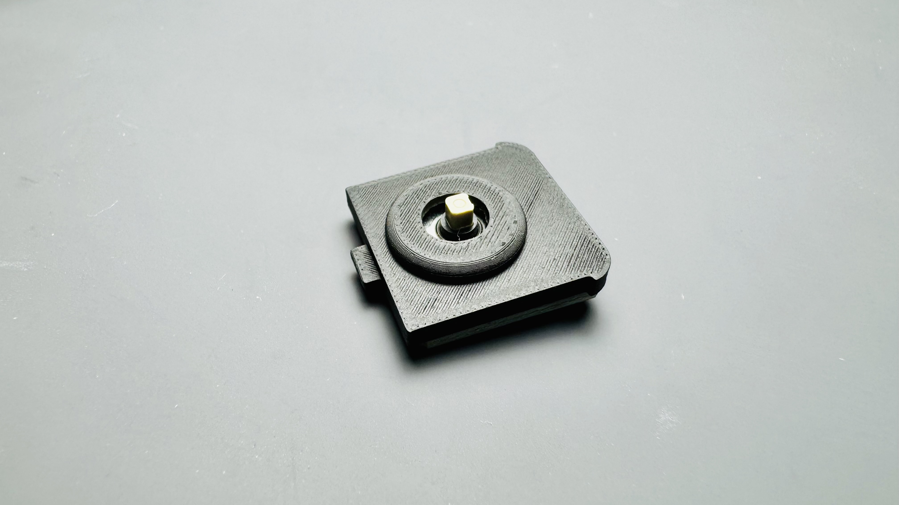

### 4. ケース組み立て
1. トップケースと基板をスライドし、ボトムケース壁面の凹へトップケースの凸を嵌め合わせてください。
    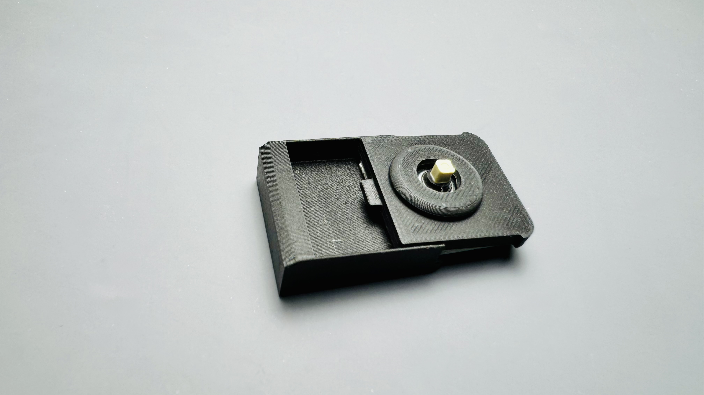  
    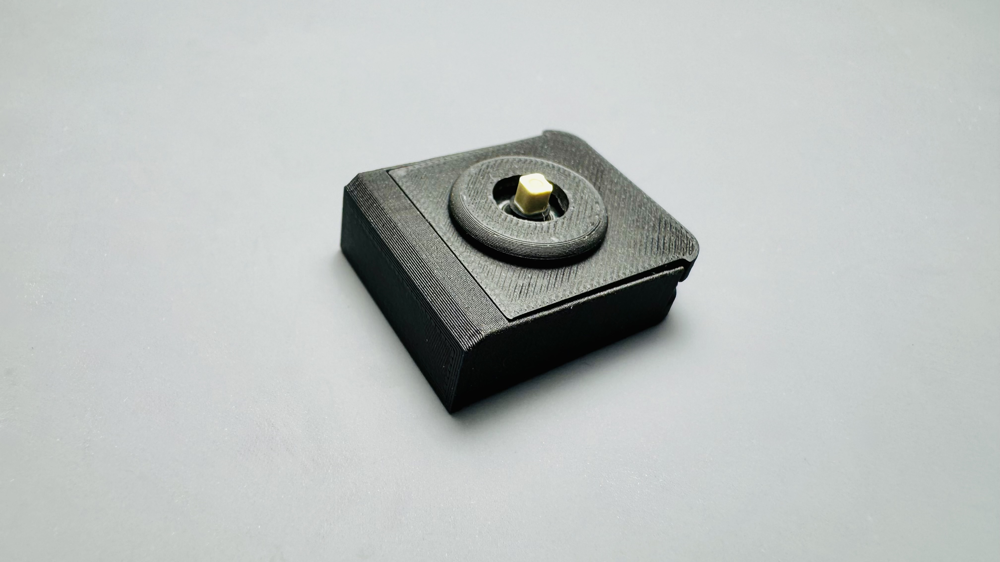

2. M2ネジで固定します。(締め過ぎ注意)
    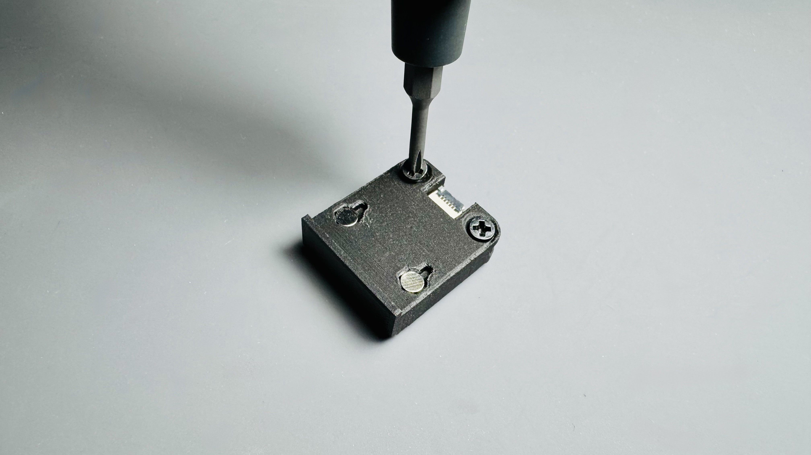

3. スティックを挿入して完成です。  
    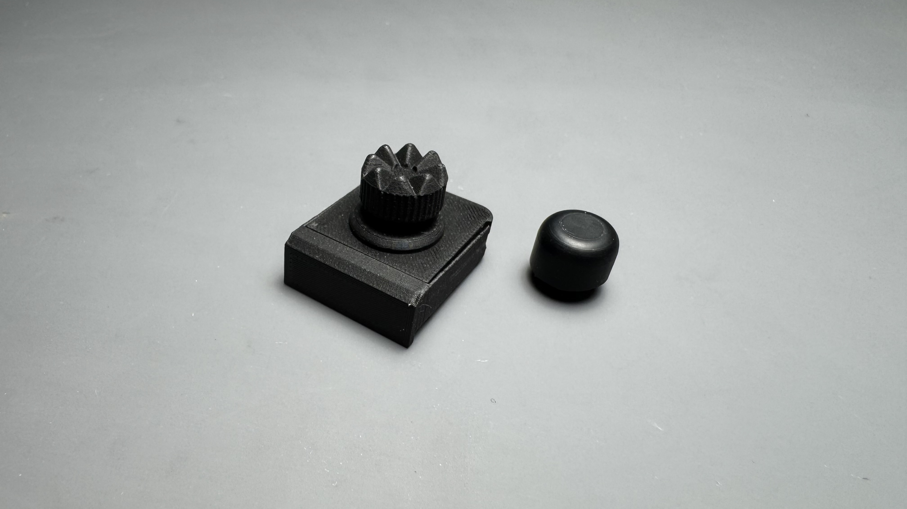  

    :::tip[操作感を柔らかくしたい場合]
    `スティック`の代わりに`スティック(シリコンキャップ用)`+`シリコンキャップ`を取り付けることができます。
    :::

---

## 本体への取り付け
組み立てたモジュールは、[モジュール付け替えの手順](../../../how2#モジュール付け替え)を参考に本体に取り付けてください。
