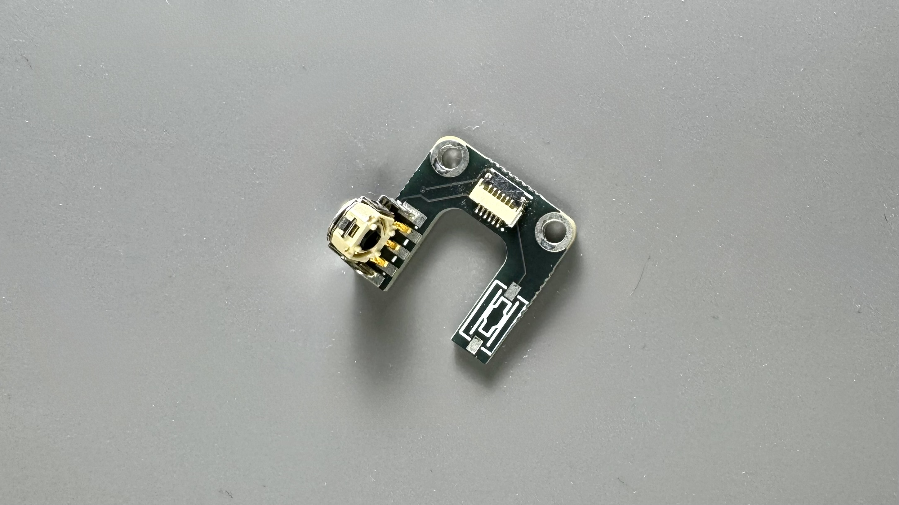
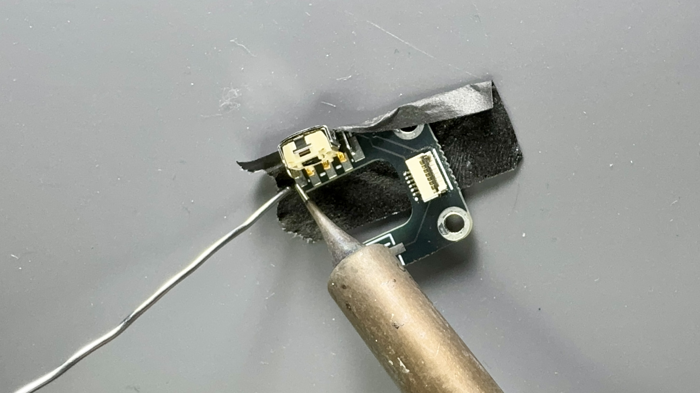
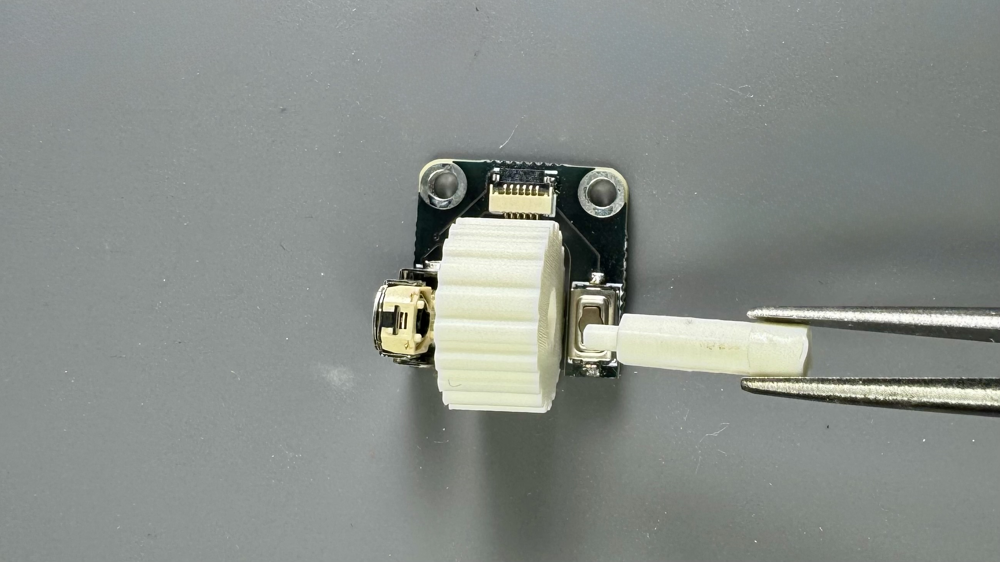
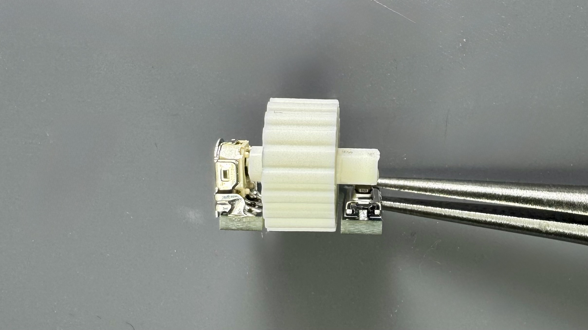
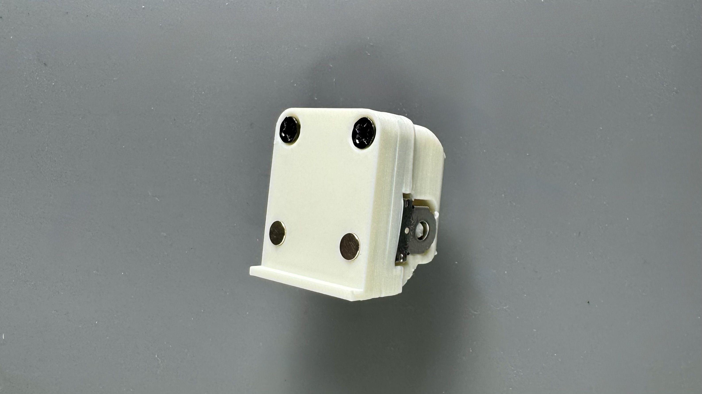

1Uサイズの`水平ロータリーエンコーダー`モジュールのビルドガイドです。

## 内容物

| 部品名 | 数量 | 備考 |
| :--- | :--- | :--- |
| 基板 | 1 | |
| エンコーダー | 1 | EC05E1220203 |
| スイッチ | 1 | SKQYACE010 |
| ネジ | 2 | M2 x 8mm |
| マグネット | 2 | 3mm x 1mm |

## ケース

:::note[ケースをご自身で用意される方は]
[ケースデータ](https://github.com/4mplelab/LisM/tree/main/3d-data/case/modules)の`HorizontalRotaryEncoder.step`を参照ください。
:::

| 部品名 | モデル名 | 備考 |
| :--- | :--- | :--- |
| ステム | Stem | |
| ホイール | Wheel | |
| トップケース | TopPart | |
| ボトムケース | BottomPart | |

---

## 必要な工具

*   はんだごて
*   はんだ
*   ドライバー (+)

---

## 組み立て手順
### 1. はんだ付け

:::tip[細い小手先の方がやりやすいと思います]
:::

1. エンコーダーを画像の様に配置してください。(テープ等で固定した方がやりやすいです)  
    
   
2. 両端のはんだ付けを行なってください。  
    
   
3. 端子のはんだ付けを行なってください。  
4. スイッチの両端をはんだ付けしてください。  
    

:::danger[エンコーダーが垂直に取り付けられているか確認]
垂直に取り付けられていない場合（特に外側に斜めになっている場合）、ケースが変形してホイール回転時に引っかかってしまいます。
:::

### 2. ボトムケースへマグネット取り付け
1. 底面(手前側)2カ所へマグネットを取り付けてください。
   
    :::caution[本体のマグネットの極性に合わせる必要があります]
    :::

    

### 3. ケース組み立て
1. ホイールを置き、スイッチ側からホイールの穴をステムで通し、ステムの先端をロータリーエンコーダに差し込んでください。  
   
    :::caution[ステムは折れやすいので慎重に！]
    ステムの先端とエンコーダーの穴は六角形になっています。  
    少しずつ回し、抵抗なく入る位置になったら差し込んでください。

      
    
    :::

1. 上からトップケースを被せてください。  
    
   
2. ボトムケースの(奥側の)ネジ穴を合わせ、M2ネジで固定して完成です。(締め過ぎ注意)
    

---

## 本体への取り付け
組み立てたモジュールは、[モジュール付け替えの手順](../../../how2#モジュール付け替え)を参考に本体に取り付けてください。