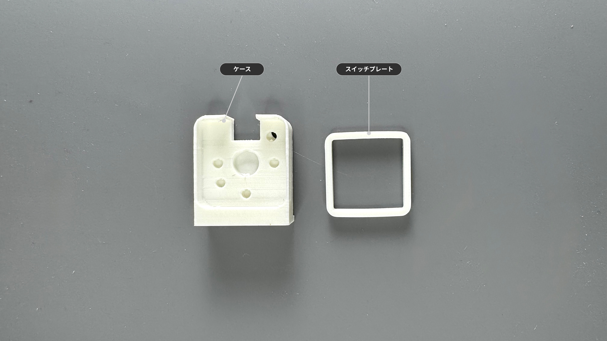
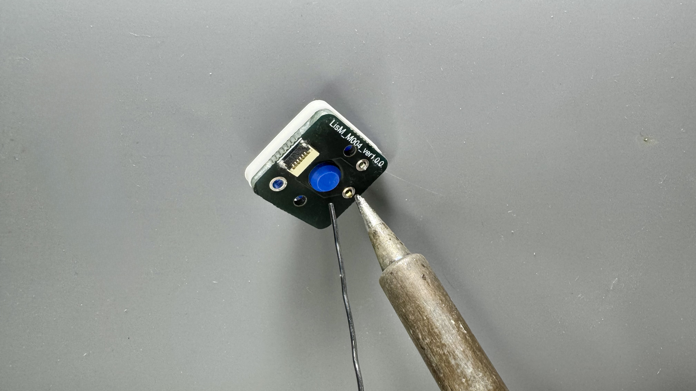
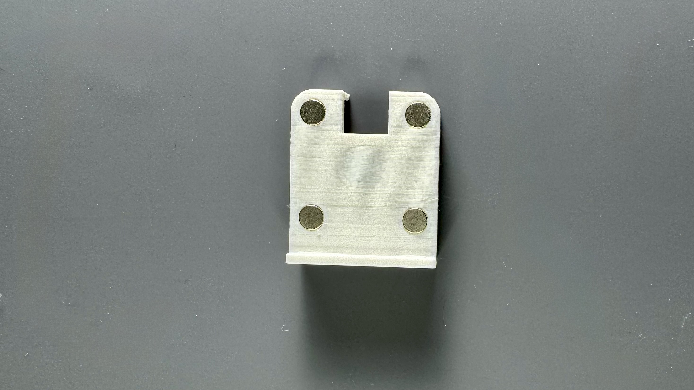
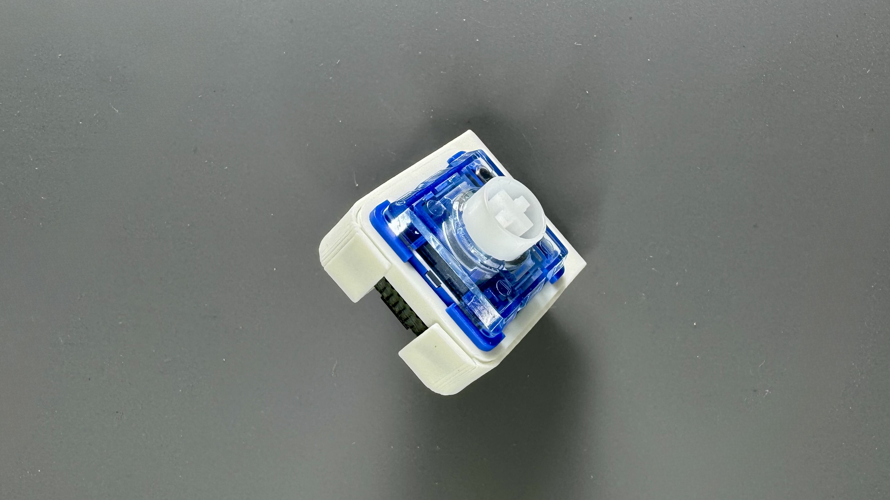

1Uサイズの`キースイッチ`モジュールのビルドガイドです。  
このモジュールはホットスワップ非対応です。

## 内容物

| 部品名 | 数量 | 備考 |
| :--- | :--- | :--- |
| 基板 | 1 | |
| マグネット | 4 | 3mm x 1mm |

## ケース

:::note[ケースをご自身で用意される方は]
[ケースデータ](https://github.com/4mplelab/LisM/tree/main/3d-data/case/modules)の`KeySwitch.step`をご使用ください。
:::

| 部品名 | モデル名 | 備考 |
| :--- | :--- | :--- |
| スイッチプレート | SwitchPlate | |
| ケース | Case | |

---

## 別途必要なもの

| 部品 | 数量 | 備考 | 
| :--- | :--- | :--- |
| キースイッチ | 1 | Kailh Choc V1 または V2 |

---

## 必要な工具

*   はんだごて
*   はんだ
  
---

## 組み立て手順

:::danger[ケースは壊れやすいので取り扱い注意]
壁が薄いので裂けやすいです。  
組み立て（特にマグネット取り付け）時は壁面に力が加わらないように細心の注意を払ってください。
:::

### 1. はんだ付け
1. キースイッチにスイッチプレートを取り付けます。  
    
   
2. 基板に差し込んでキースイッチのはんだ付けをします。  
    
   
   
### 2. ケースへマグネット取り付け
1.  ケース底面4カ所へマグネットを取り付けてください。
    

    :::caution[本体のマグネットの極性に合わせる必要があります]
    :::

### 3. ケース組み立て
1. FFCコネクタが奥になる様に、キースイッチをケースへ差し込んで完成です。
    
   
    :::tip[緩い場合はテープ等で隙間を埋めてください]
    :::

---

## 本体への取り付け
組み立てたモジュールは、[モジュール付け替えの手順](../../../how2#モジュール付け替え)を参考に本体に取り付けてください。