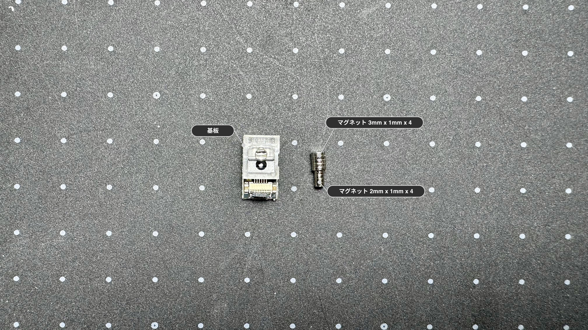
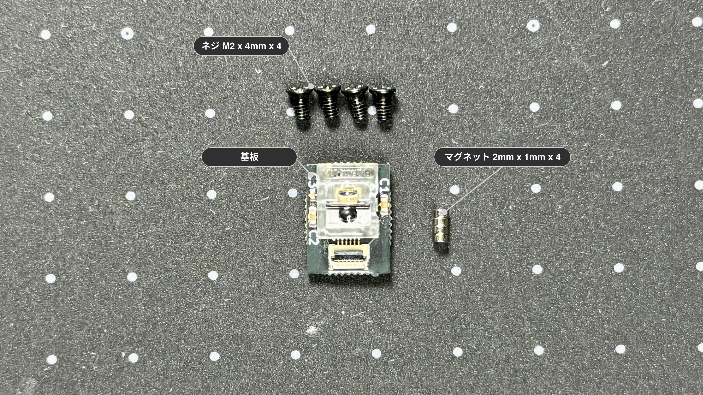
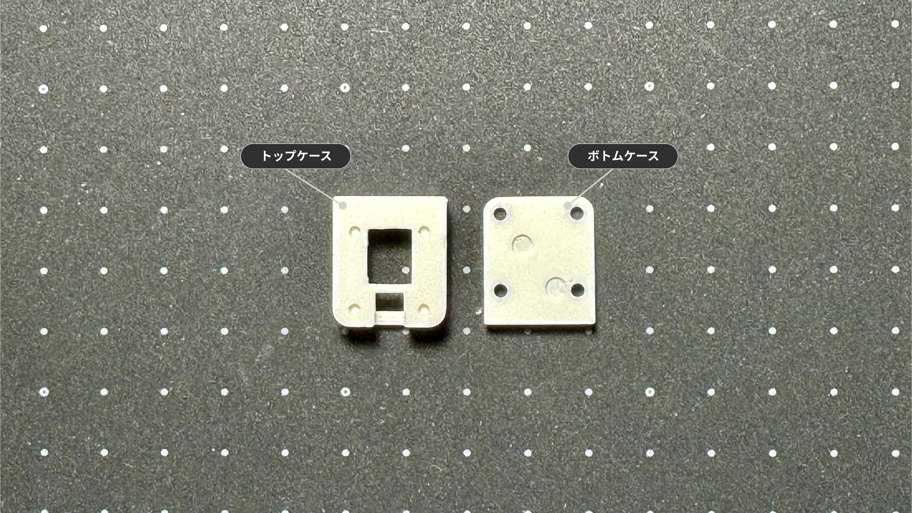
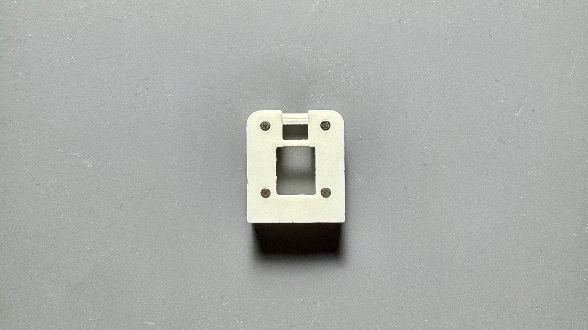
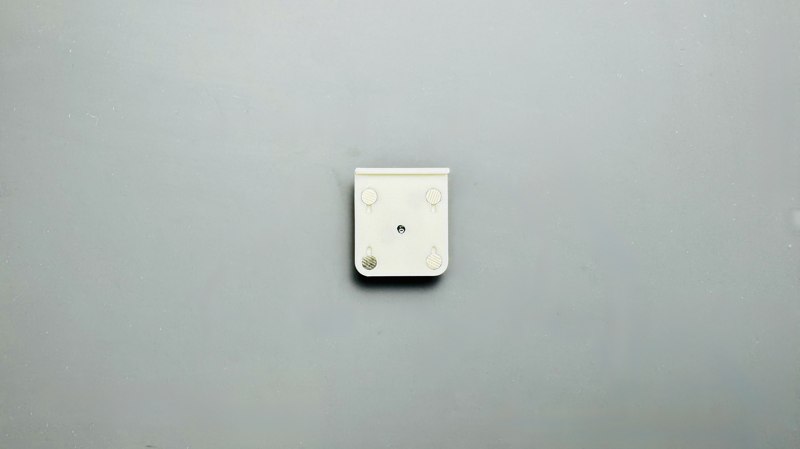
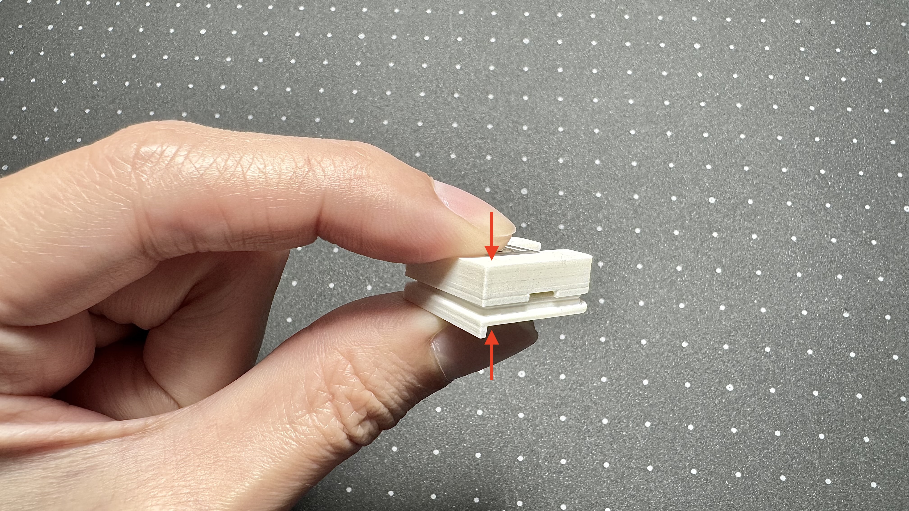
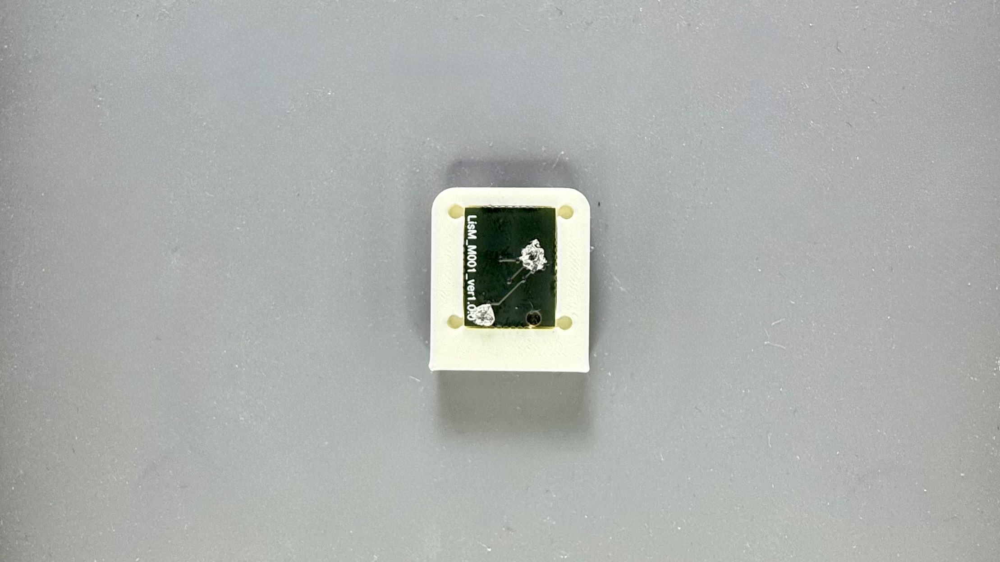
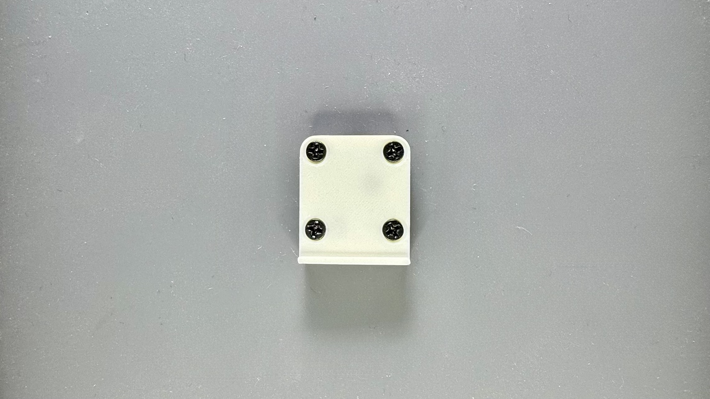
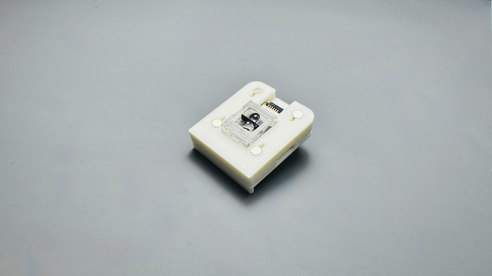
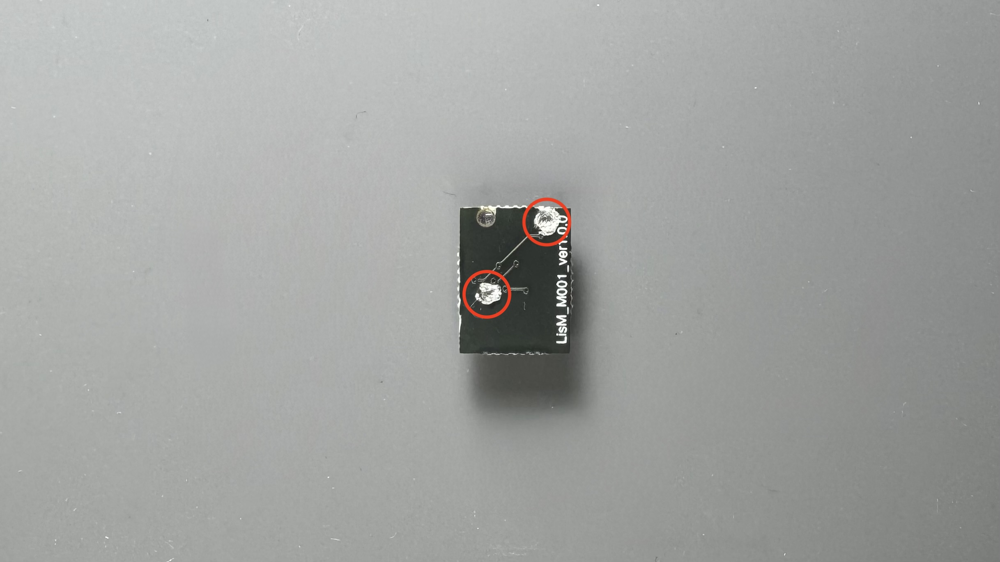

import { Tabs, TabItem } from '@astrojs/starlight/components';
import { Badge } from '@astrojs/starlight/components';

1Uサイズの`トラックボールセンサー`モジュールのビルドガイドです。  

<Badge text="2025.12 変更" variant="note" /> 本体との固定はマグネットに変更しました。  
内容物・ケースが変更されています。

## 内容物
<Tabs syncKey="case_version">
<TabItem label="マグネットver">

| 部品名 | 数量 | 備考 |
| :--- | :--- | :--- |
| 基板 | 1 | PAW3222搭載 |
| マグネット | 4 | 3mm x 1mm 本体接続用 |
| マグネット | 4 | 2mm x 1mm トラボユニット接続用 |

</TabItem>
<TabItem label="ネジver">

| 部品名 | 数量 | 備考 |
| :--- | :--- | :--- |
| 基板 | 1 | PAW3222搭載 |
| ネジ | 4 | M2 x 4mm |
| マグネット | 4 | 2mm x 1mm |

</TabItem>
</Tabs>

## ケース

<Tabs syncKey="case_version">
<TabItem label="マグネットver">

:::note[ケースをご自身で用意される方は]
[ケースデータ](https://github.com/4mplelab/LisM/tree/main/3d-data/case/modules)の`TrackBallSensor_SnapFit.step`を参照ください。
:::

| 部品名 | モデル名 | 備考 |
| :--- | :--- | :--- |
| トップケース | TopPart | |
| ボトムケース | BottomPart | |

</TabItem>
<TabItem label="ネジver">

:::note[ケースをご自身で用意される方は]
[ケースデータ](https://github.com/4mplelab/LisM/tree/main/3d-data/case/modules)の`TrackBallSensor.step`を参照ください。
:::

| 部品名 | モデル名 | 備考 |
| :--- | :--- | :--- |
| トップケース | TopPart | |
| ボトムケース | BottomPart | |

</TabItem>
</Tabs>

## 別途必要なもの

| 部品 | 数量 | 備考 |
| :--- | :--- | :--- |
| 任意 接着剤 | - | マグネットの穴が緩い場合の固定用 |

---

## 組み立て手順 

### 1. トップケースへマグネット取り付け
1. 4カ所へマグネット(φ2mm)を取り付けてください。
   
    :::caution[トラックボールユニットのマグネットの極性に合わせる必要があります]
    
    :::

### 2. ケース組み立て

     
<Tabs syncKey="case_version">
<TabItem label="マグネットver">
1. ボトムケースへマグネット(φ3mm)を取り付けてください。  
    :::caution[本体のマグネットの極性に合わせる必要があります]
    :::
    

1. FFCコネクタの位置を確認し、ボトムケースへ基板を入れてください。  
      
    :::caution[嵌合が固くて嵌らない場合、基板側面を軽く削ってください]
    :::
   
1. トップケースとボトムケースを合わせて嵌めてください。
      
</TabItem>
<TabItem label="ネジver">
1. FFCコネクタの位置を確認し、トップケースへ基板を入れてください。  
    
2. ボトムケースをM2ネジで固定して完成です。(締め過ぎ注意)  
      
</TabItem>
</Tabs>

完成  
  

:::note[トップケースとボトムケースで隙間が空く場合]
基板裏面のレンズ固定箇所が干渉している可能性があります。  
気になる方はニッパー等で切り、干渉を除去してください。(削りすぎ注意)   

:::

---

## 本体への取り付け
組み立てたモジュールは、[モジュール付け替えの手順](../../../how2#モジュール付け替え)を参考に本体に取り付けてください。