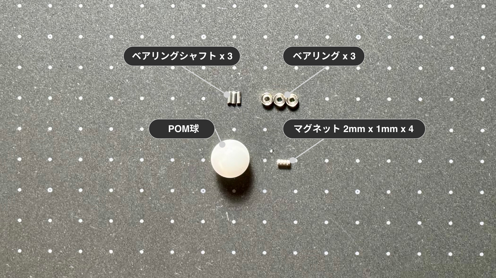
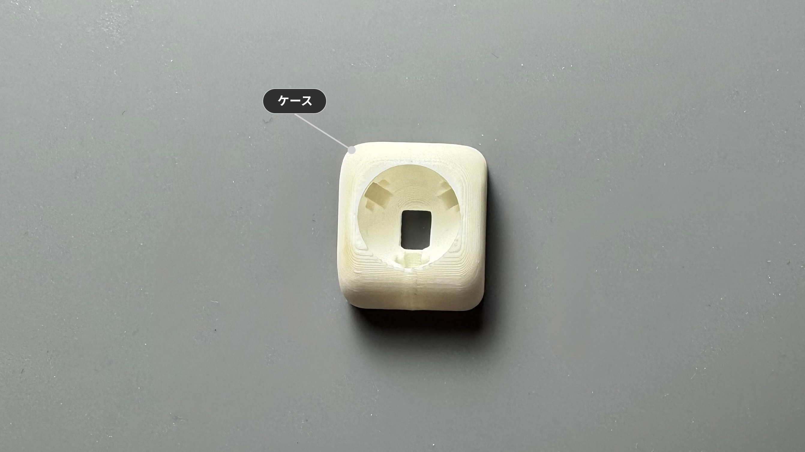
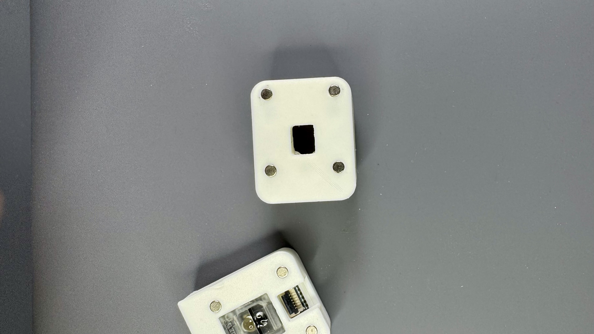
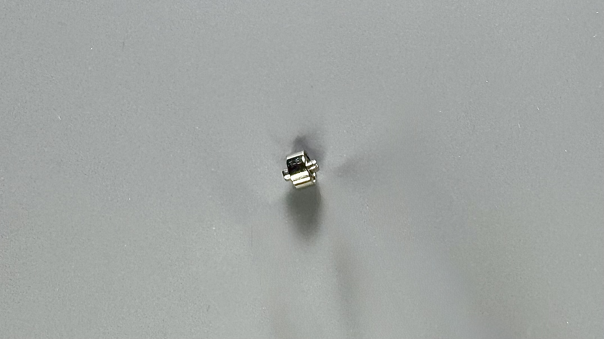
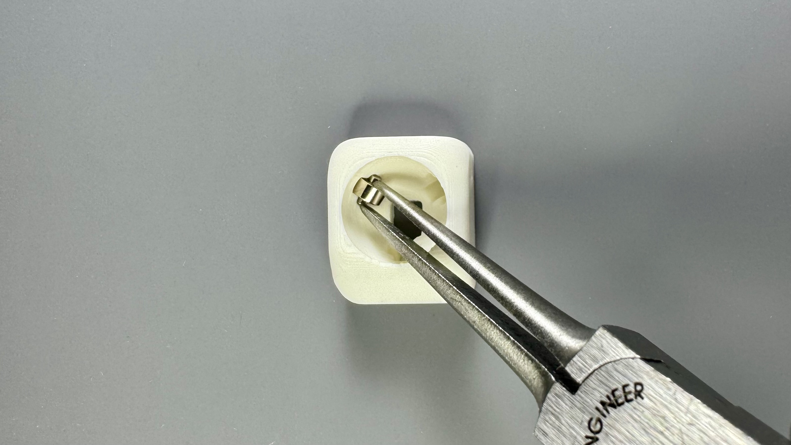
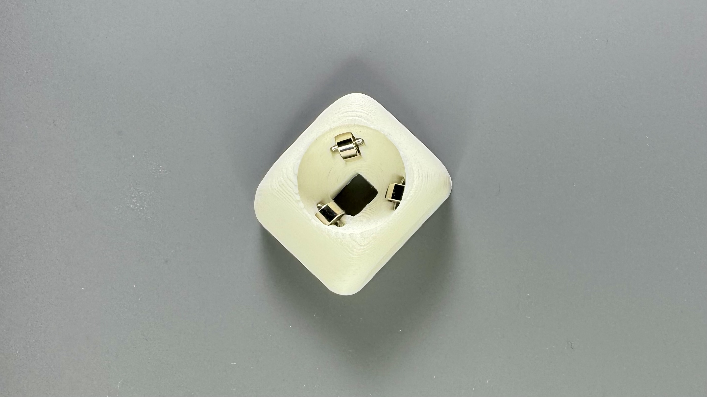
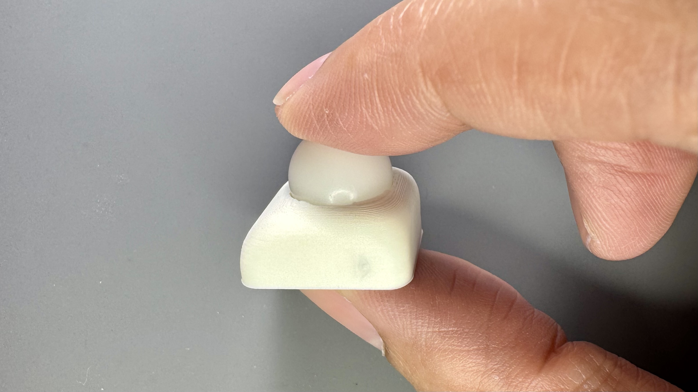

10, 12, 14mmボールを使用したトラックボールユニットのビルドガイドです。

---

## 内容物

| 部品名 | 数量 | 備考 |
| :--- | :--- | :--- |
| POM球 | 1 | 10 or 12 or 14mm |
| ベアリング | 3 | 1.5 x 4 x 2mm |
| ベアリングシャフト | 3 | 1.4mm x 4mm |
| マグネット | 4 | 2mm x 1mm |

:::tip[より滑らかな回転を求める方へ]
付属のベアリングを、同サイズの`ミネベア DDL-415ZZ`に交換すると、回転がより滑らかになります。

- [ミネベア DDL-415ZZ (1個)](https://link.amazon/B09AW9b0e)広告
- [ミネベア DDL-415ZZ (4個セット)](https://link.amazon/B0anhGGv5)広告
- [ミネベア DDL-415ZZ (6個セット)](https://link.amazon/B0b0M6U2S)広告
- [ミネベア DDL-415ZZ (8個セット)](https://link.amazon/B00PCltxn)広告
:::

## ケース

:::note[ケースをご自身で用意される方は]
[ケースデータ](https://github.com/4mplelab/LisM/tree/main/3d-data/case/units)の`TrackBall(10 or 12 or 14)mm.step`をご使用ください。
:::

| 部品名 | モデル名 | 備考 |
| :--- | :--- | :--- |
| ケース | (10 or 12 or 14)mmCase | |

---

## 別途必要なもの

| 部品 | 数量 | 備考 |
| :--- | :--- | :--- |
| 任意 接着剤 | - | マグネットの穴が緩い場合の固定用 |

---

## 必要な工具

*   ピンセット or 先端が細いペンチ

---

## 組み立て手順

:::note[ボールサイズによってケースの形状が多少異なりますが、どのサイズでも手順は同じです]
:::

### 1. マグネット取り付け
1. 底面の4カ所へマグネットを取り付けてください。
   
    :::caution[センサーモジュールのマグネットの極性に合わせる必要があります]
    
    :::

### 2. ベアリング取り付け
1. ベアリングへベアリングシャフトを挿入します。(3個)  
    
   
2. 両端から同じ長さが出るように調整し、ケースの3カ所へ取り付けてください。  
   シャフトをピンセット等で押すと嵌ります。  

    :::tip[最終的にボールで押し込まれるので、この時点で奥まで入れる必要はありません]
      
    
    :::

### 3. POM球取り付け
1. POM球を上から押し込んで完成です。  
    