19mmボールを使用したトラックボールユニットのビルドガイドです。

## 内容物
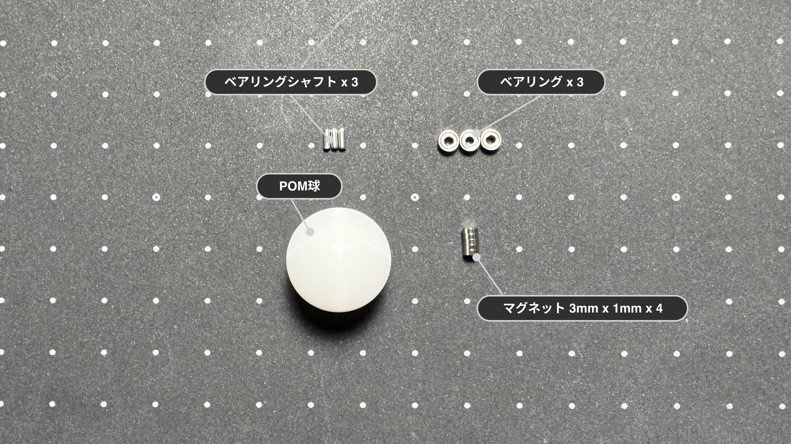

| 部品名 | 数量 | 備考 |
| :--- | :--- | :--- |
| POM球 | 1 | 19mm |
| ベアリング | 3 | 1.5 x 4 x 2mm |
| ベアリングシャフト | 3 | 1.4mm x 4mm |
| マグネット | 4 | 3mm x 1mm |

## ケース

:::note[ケースをご自身で用意される方は]
[ケースデータ](https://github.com/4mplelab/LisM/tree/main/3d-data/case/units)の`TrackBall19mm.step`をご使用ください。
:::

| 部品名 | モデル名 | 備考 |
| :--- | :--- | :--- |
| ケース本体 | 19mmCase_[L/R] | |
| ケースモジュール部 | 19mmCase_[L/R]_Bottom | |
| ダボ | Dowel |  |

[L/R]は`Left` または `Right`

---

## 別途必要なもの

| 部品 | 数量 | 備考 |
| :--- | :--- | :--- |
| 接着剤 | 1 |  |

---

## 必要な工具

*   ピンセット or 先端が細いペンチ

---

## 組み立て手順

### 1. 固定用マグネット取り付け
1. `ケースモジュール部`へマグネットを取り付けてください。
   
    :::caution[本体のマグネットの極性に合わせる必要があります]
    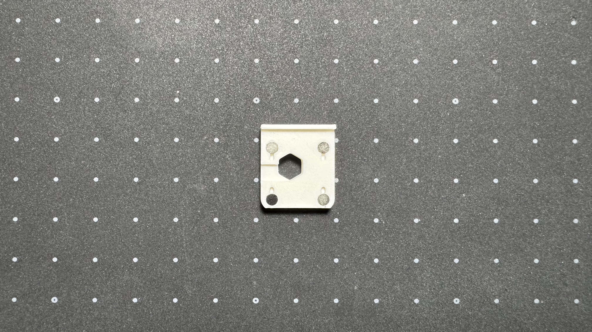
    :::

### 2. ベアリング取り付け
1. ベアリングへベアリングシャフトを挿入してください。  
   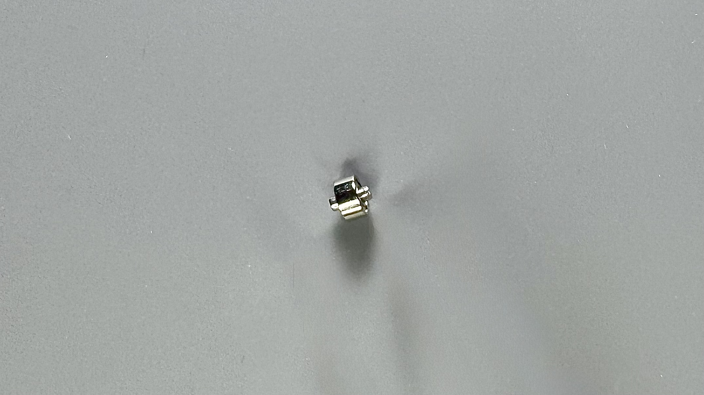
   
2. 両端から同じ長さが出るように調整し、ケースの3カ所へ取り付けてください。  
   シャフトをピンセット等で押すと嵌ります。  

    :::tip[最終的にボールで押し込まれるので、この時点で奥まで入れる必要はありません]
    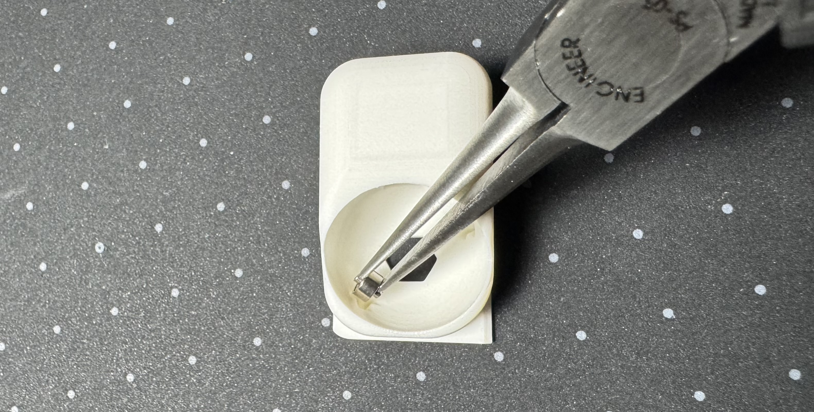  
    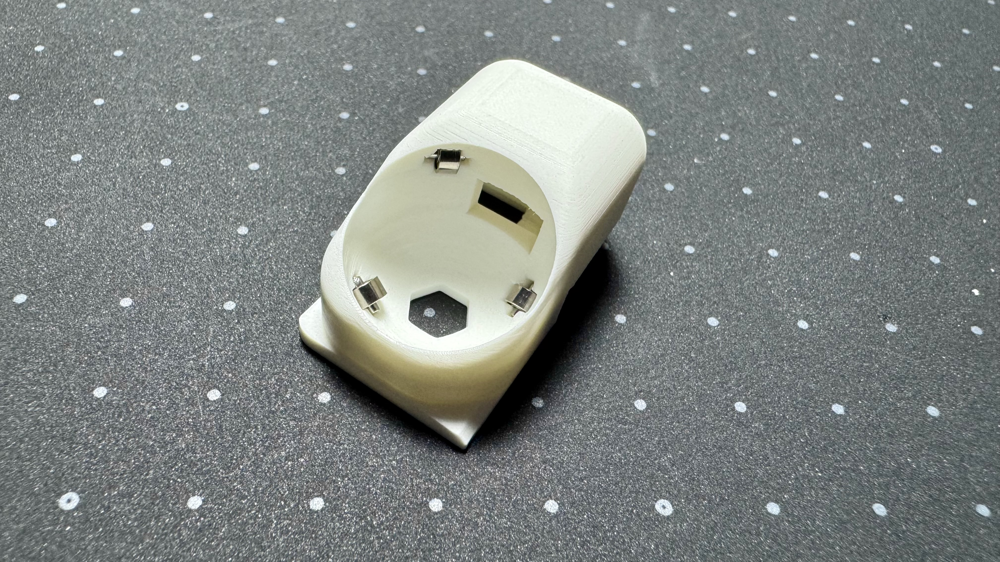
    :::

### 3. 組み立て
1. `ケース本体`または`ケースモジュール部` へ`ダボ`を嵌めてください。  
   なくても問題はないですが、あった方が位置ズレのリスクが減ります。  
   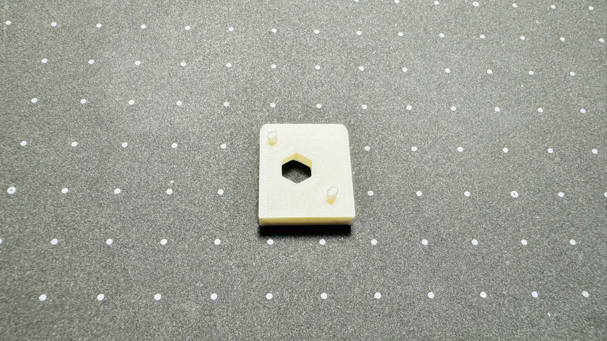  

  
2. 接着剤を塗布し、しっかり固定してください。  
    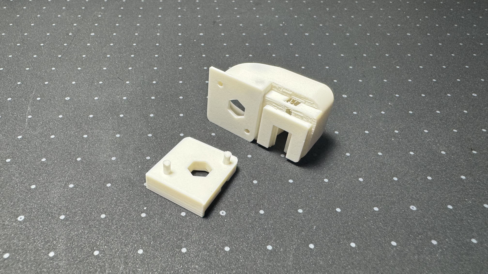  
    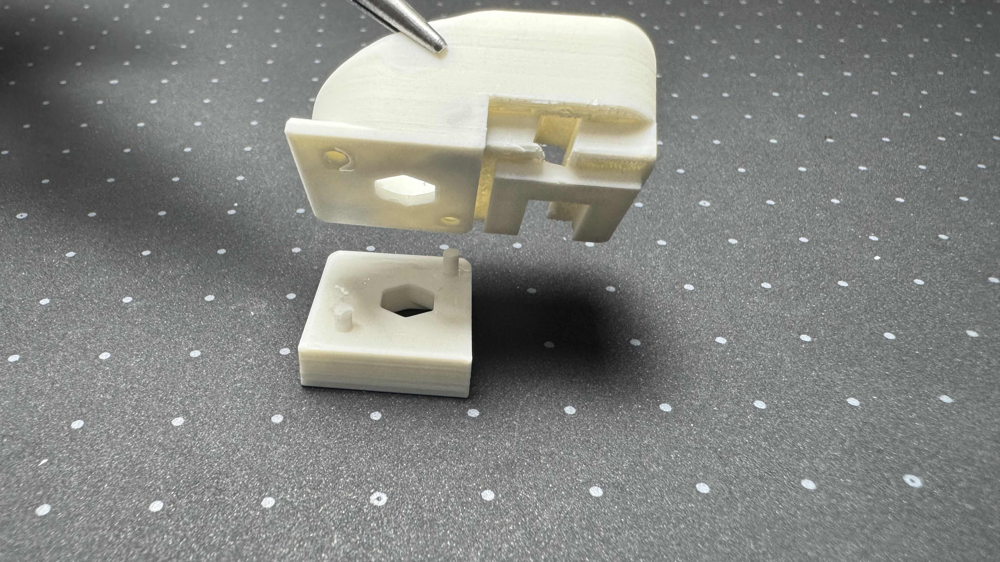  
    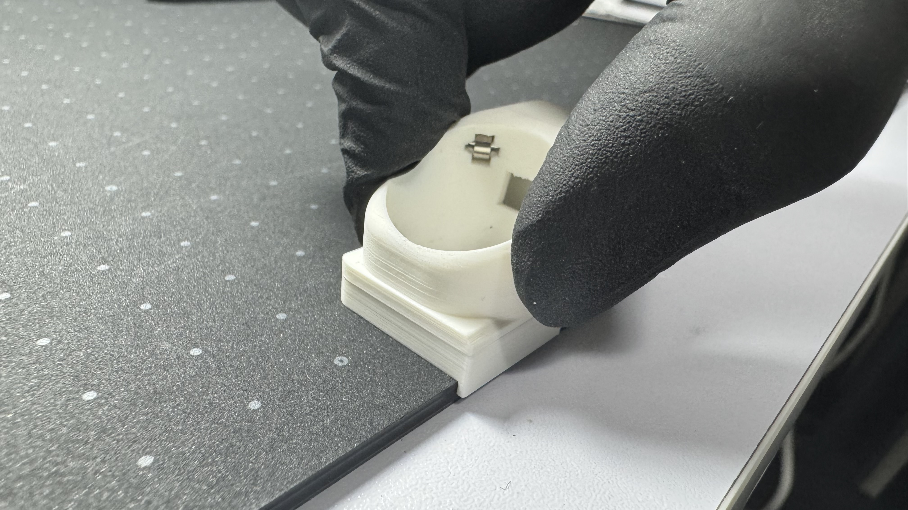

### 4. トラックボール取り付け
1. トラックボールを押し込んで完成です。  
   滑らかに回転することを確認してください。

    :::tip[滑らかに回転しない場合]
    上のベアリングが正しく(奥まで)装着されていない可能性が高いです。  
    ボールを上のベアリングに向けて押さえつけてください。
    :::

---

## 付け替え方法

1. トラックボールセンサーをケースから取り出し、FFCを外します。  
   [センサーのビルドガイド](../../modules/trackball_sensor#組み立て手順)を参照し、逆の手順でケースを外してください。  

2. モジュールの隣のキースイッチを取り外します。  
   左側キーボードの場合：左側のキー ／ 右側キーボードの場合：右側のキー  
    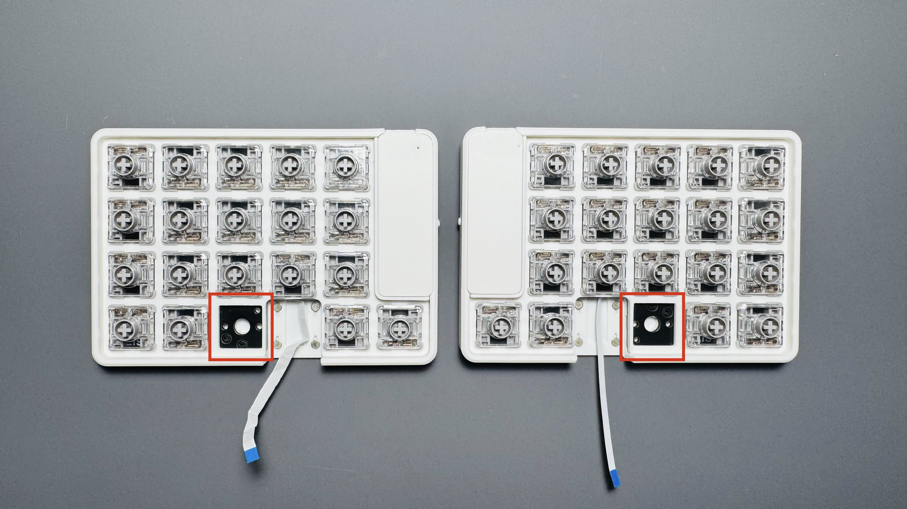

3. FFCを取り外したキーの穴から取り出します。  
   （スパッジャーを使用すると出しやすいです）  
    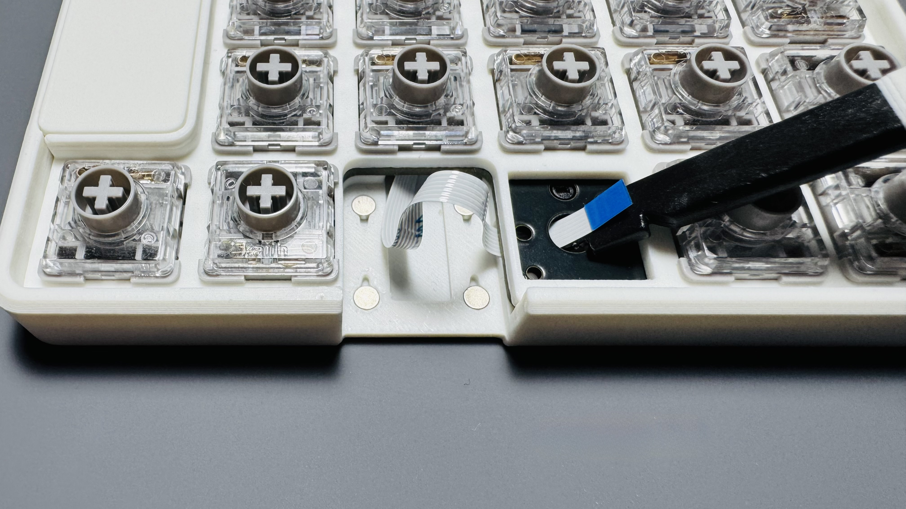

4. トラックボールセンサーを取り付け、FFCを画像のように取り回します。  
    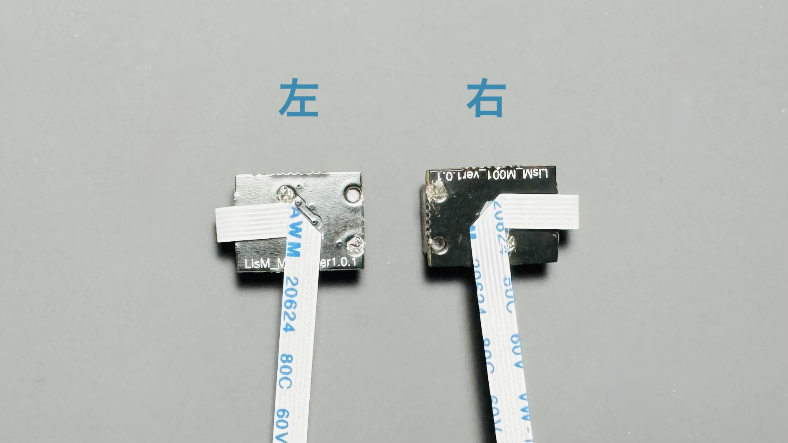

    :::danger[根本から曲げると断線します！！]
    FFCコネクタから少し離れた部分で軽く曲げてください。  
    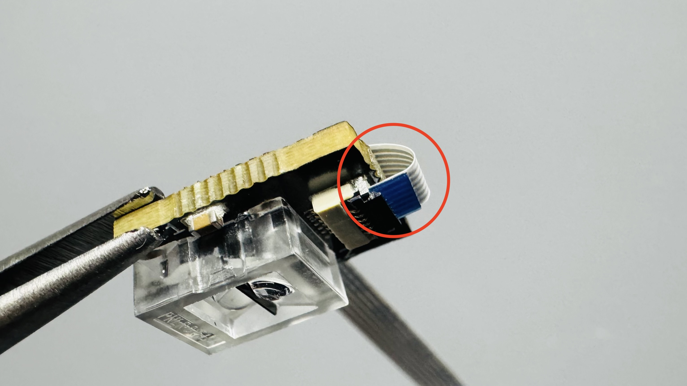
    :::

5. センサーとFFCをケースへ入れ、奥まで入れてください。  
   センサーがズレるので、FFCも一緒にいれてください。  
    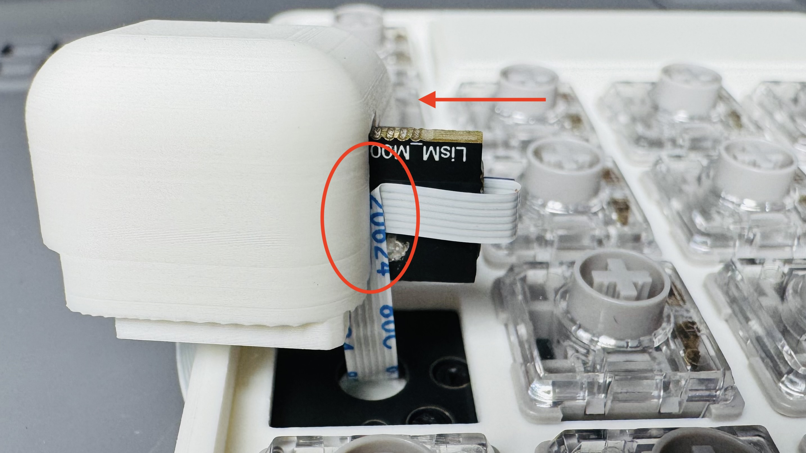

6. FFCが挟まらないように避けながら、ケースを本体へ固定して完成です。  
    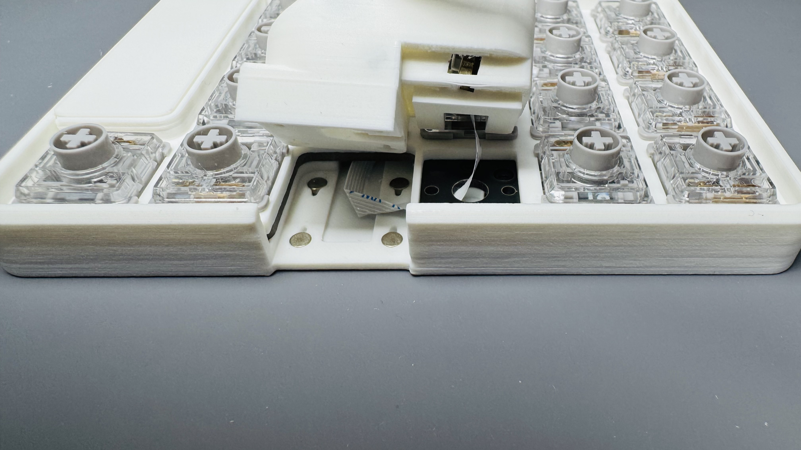  
    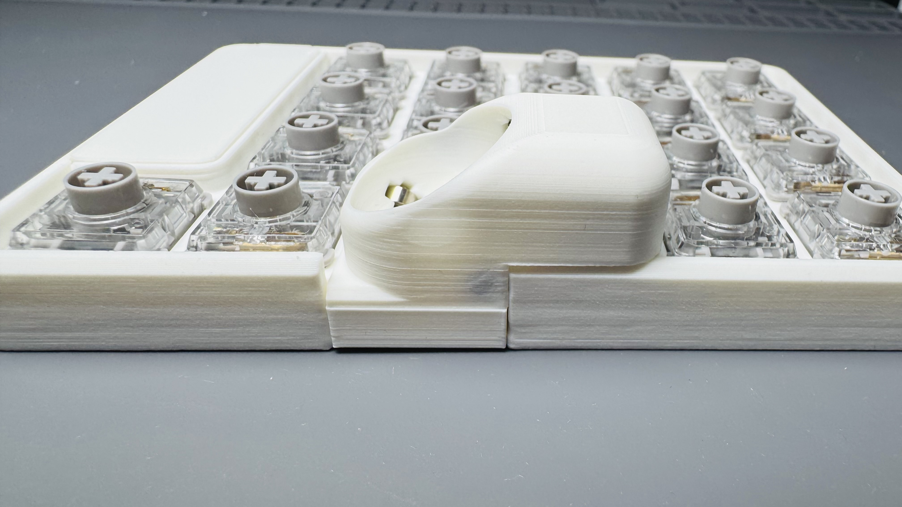

---

## センサー取り外し

:::danger[奥側からセンサーを引き抜かないで]
FFCの断線・コネクタのフリップ破損に繋がります。
:::

1. 手前側の穴からセンサーの基板部分を押して、取り出してください。
    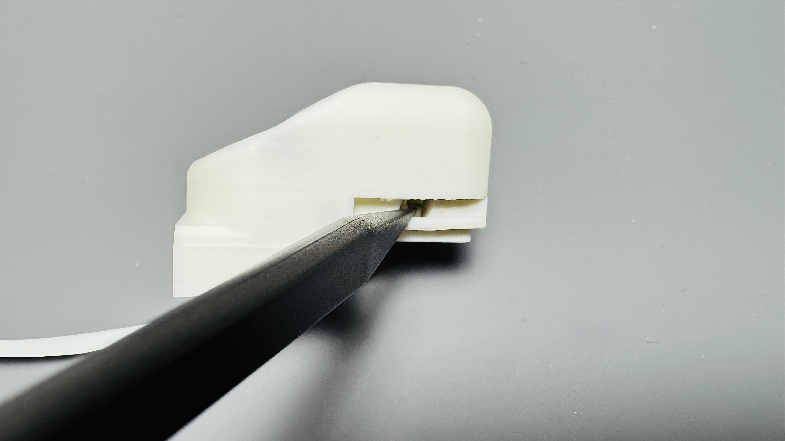  
   