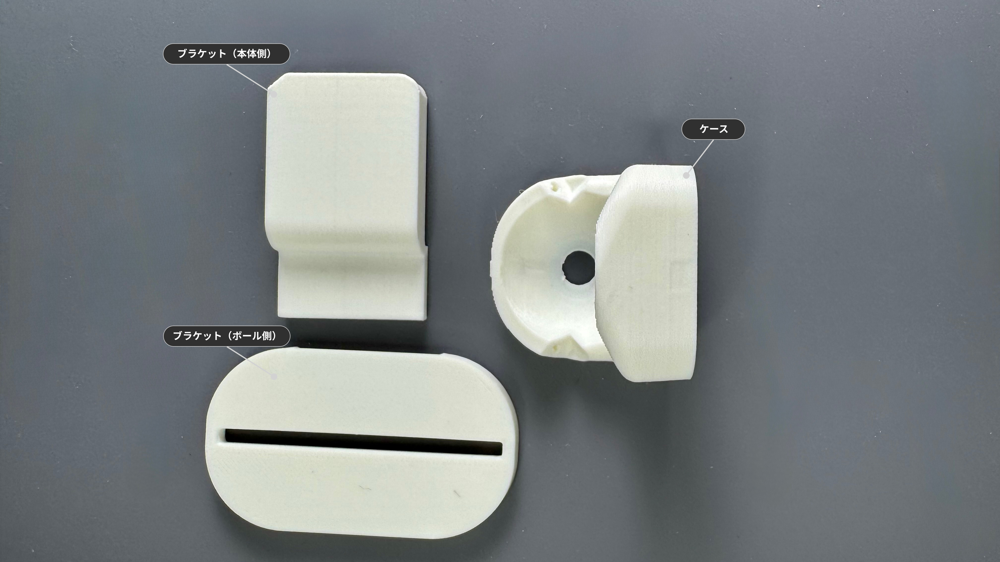
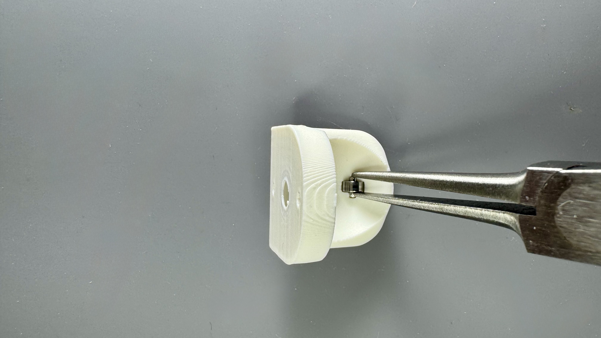
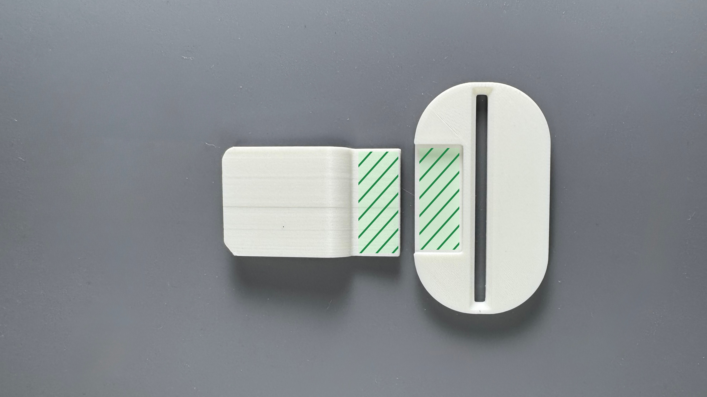
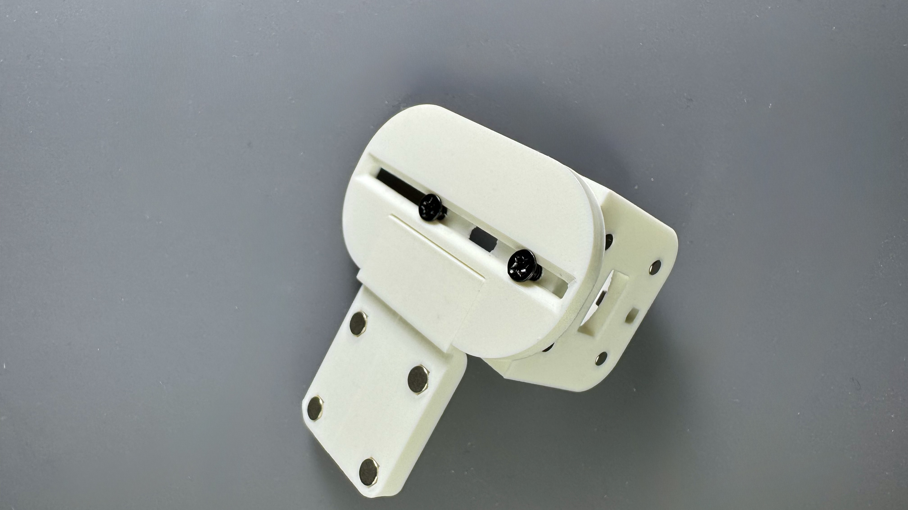
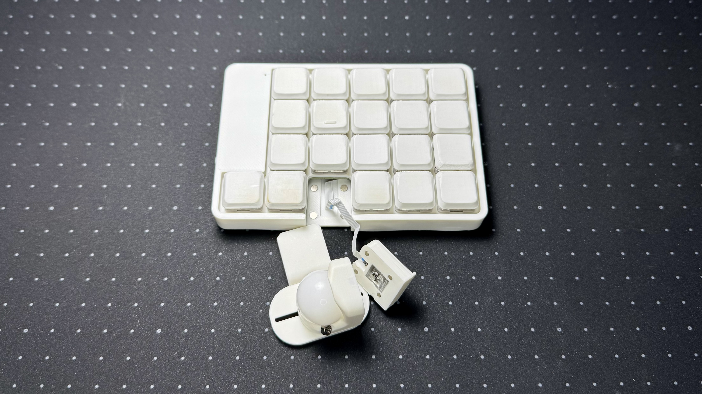

20mmボールを使用したトラックボールユニットのビルドガイドです。

## 内容物

| 部品名 | 数量 | 備考 |
| :--- | :--- | :--- |
| POM球 | 1 | 20mm |
| ベアリング | 3 | 1.5 x 4 x 2mm |
| ベアリングシャフト | 1 | 1.4mm x 4mm |
| ネジ | 2 | M1.4 x 5mm |
| ネジ | 2 | M2 x 4mm |
| マグネット | 4 | 3mm x 1mm |
| マグネット | 4 | 2mm x 1mm |

## ケース

:::note[ケースをご自身で用意される方は]
[ケースデータ](https://github.com/4mplelab/LisM/tree/main/3d-data/case/units)の`TrackBall20mm.step`をご使用ください。
:::

| 部品名 | モデル名 | 備考 |
| :--- | :--- | :--- |
| ケース | 20mmCase | |
| ブラケット(本体側) | Bracket4Main | |
| ブラケット(ボール側) | Bracket4TrackBallCase | |

---

## 別途必要なもの

| 部品 | 数量 | 備考 |
| :--- | :--- | :--- |
| 接着剤 | 1 |  |

---

## 必要な工具

*   ピンセット or 先端が細いペンチ
*   ドライバー (+)

---

## 組み立て手順

### 1. センサー固定用マグネット取り付け
1. トラックボールケースの側面へマグネットを取り付けてください。
   
    :::caution[センサーモジュールのマグネットの極性に合わせる必要があります]
    
    :::

### 2. ベアリング取り付け
1. ベアリングへベアリングシャフトを挿入してください。  
   
   
2. 両端から同じ長さが出ていることを確認し、ケースへ取り付けてください。  
   シャフトをピンセット等で押すと嵌ると思います。  
   

3. 他2カ所はM1.4のネジで固定してください。
   
    :::caution[ネジは垂直に入れてください]
    斜めに固定されるとベアリングがボールに当たりません。
    :::
    
    :::caution[締めすぎないこと]
    締めすぎるとネジ穴が広がり、緩くなる場合があります。  
    ベアリングを固定できる程度に締めてください。
    :::

    
   

### 3. ブラケット組み立て
1. 底面の4カ所へマグネットを取り付けてください。
   
    :::caution[本体のマグネットの極性に合わせる必要があります]
    
    :::

1. `ブラケット(本体側)`と`ブラケット(ボール側)` へ接着剤を塗布し、固定してください。  
      
    
    

### 4. ブラケットとトラックボールケースの固定
1. トラックボールケースを載せ、お好きな位置に調整し、底面からM2ネジで固定してください。  
   (位置調整ができる程度に締めるのもオススメです)  
      
    

    :::note[左手側で使用する場合は180°回転させて固定してください]
    :::

### 5. トラックボール取り付け
1. トラックボールを押し込んで完成です。  
   滑らかに回転することを確認してください。

---

## 付け替え方法

:::note[本体へトラックボールセンサーが取り付け済みであることを前提とします]
:::

1. 本体からトラックボールセンサーを引き出します。  
      
   
2. 20mmトラックボールケースへ、FFCが奥になるようにセンサーモジュールを取り付けてください。  
      
   
3. FFCが干渉しないように避けながら、本体とブラケットを接続してください。  
    