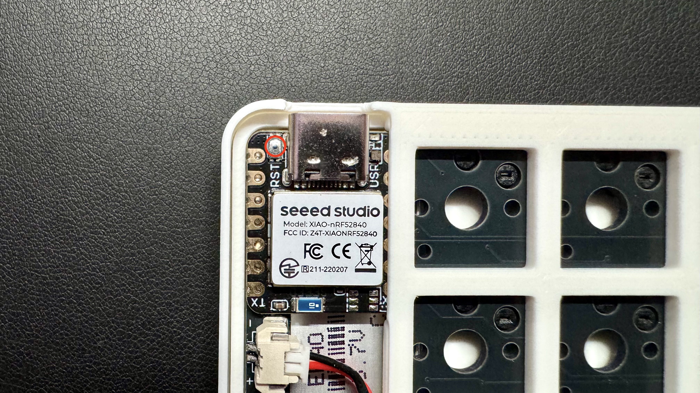

LisMはZMKファームウェアを使用しています。  
キーマップの変更やモジュールの構成変更には、ファームウェアの書き換えが必要です。

- **[zmk-config-LisM](https://github.com/4mplelab/zmk-config-LisM)**  

---

## セントラルとペリフェラル
デフォルトでは`右がセントラル`, `左がペリフェラル`です。  
`build.yaml`を編集してビルドすることで逆にすることも可能です。

---

## 主な編集箇所

- キーマップやコンボ  
  `config/lism.keymap`を編集します。  
  （KeymapEditorで変更できる内容です）

- ハードウェア構成など  
  `boards/`や`snippets/`内のファイルを編集します。  
  （例えば、デュアルトラボで片側をスクロール固定にしたい場合など）

---

## モジュール構成とファームウェア

左右のキーボードには、それぞれ対応したファームウェアを書き込む必要があります。  
ファームウェアはモジュールの組み合わせによって異なります。

| 左側モジュール | 右側モジュール | 左手側ファームウェア | 右手側ファームウェア |
| :--- | :--- | :--- | :--- |
| トラックボール       | 非トラックボール[^1] | `lism_left_[c/p]_trackball.uf2` | `lism_right_[c/p]_non_trackball.uf2` |
| 非トラックボール[^1] | トラックボール       | `lism_left_[c/p]_non_trackball.uf2` | `lism_right_[c/p]_trackball.uf2` |
| 非トラックボール[^1] | 非トラックボール[^1] | `lism_left_[c/p]_non_trackball.uf2` | `lism_right_[c/p]_non_trackball.uf2` |
| トラックボール       | トラックボール       | `lism_left_[c/p]_trackball.uf2` | `lism_right_[c/p]_trackball.uf2` |

[c/p]は`central` または `peripheral`

[^1]:「非トラックボール」モジュールには以下が含まれます。  
    - 水平ロータリーエンコーダー  
    - 垂直ロータリーエンコーダー  
    - キースイッチ

---

import { Image } from 'astro:assets';
import boot1 from 'img/boot_01.jpeg';
import boot2 from 'img/boot_02.jpeg';
import err1 from 'img/write_fw_mac_err01.png';
import err2 from 'img/write_fw_mac_err02.png';

## ファームウェアの書き込み手順

ファームウェアを書き換えるには、キーボードを「ブートローダーモード」で起動し、PCに接続する必要があります。

1. **USBケーブルでPCと接続する**
   
2.  **ブートローダーモードで起動する**  
    以下の**いずれか**の方法でブートローダーモードにしてください。  
    - 反対側のキーボードの外側1番下のキーを押しながら、ブートローダーモードにしたい側のキーボードの外側1番下キーを押します。  
        

            <Image src={boot1} alt="boot1" />
            <Image src={boot2} alt="boot2" />
        

    - キーボード底面のリセットボタンを**リセットボタンを素早く2回押し**ます。  
      
    - XIAOの**リセットボタンを素早く2回押し**ます。  
      
  

    成功すると、PC上にUSBドライブとして認識されます。

3.  **ファームウェアファイルをコピーする**
    - `.uf2` 形式のファームウェアファイルを、表示されたUSBドライブにドラッグ＆ドロップでコピーします。
    - コピーが完了すると、キーボードは自動的に再起動します。

    :::tip[macOSでは書き込み後に以下のメッセージが表示されますが、典型挙動で問題ありません]
    これらのメッセージが表示されても正しく書き込まれています。  
    

        <Image src={err1} alt="err" />
        <Image src={err2} alt="err" />
    

    :::

--- 

## キーマップの変更方法

キーマップの変更には、主に以下の3つの方法があります。ご自身の環境や好みに合わせて選択してください。

### 1. ローカル環境でのビルド (推奨)

ご自身のPCに[Docker](https://www.docker.com/products/docker-desktop/)と[VS Code](https://code.visualstudio.com/)を準備することで、最も手軽かつ高速にキーマップの試行錯誤ができます。GitHubアカウントは不要で、一度環境を構築すれば、約30秒でビルドが完了します。

**こちらが最も推奨される手順です。**

**準備:**

1.  **[Visual Studio Code](https://code.visualstudio.com/)** をインストールします。
2.  **[Docker Desktop](https://www.docker.com/products/docker-desktop/)** をインストールし、起動しておきます。
3.  VS Codeの拡張機能「**[Dev Containers](https://marketplace.visualstudio.com/items?itemName=ms-vscode-remote.remote-containers)**」をインストールします。
4.  [zmk-config-LisMリポジトリ](https://github.com/4mplelab/zmk-config-LisM) をPCにクローン（またはzipでダウンロードして展開）します。

**手順:**

1.  **Dev Containerの起動**
    1.  クローンしたリポジトリのフォルダをVS Codeで開きます。
    2.  画面右下に「Reopen in Container」という通知が表示されたら、そのボタンをクリックします。(初回起動時は環境構築のため数分かかります)

2.  **キーマップの編集**  
    コンテナ内の`config/lism.keymap`ファイルがキーマップの定義です。以下のいずれかの方法で編集します。

    *   **Keymap Editorを利用する場合:**
        1.  [Keymap Editor](https://nickcoutsos.github.io/keymap-editor/)を開きます。(GitHubでのサインインは不要です)
        2.  `Source`から`Clipboard`を選択します。
        3.  `Keyboard`から`New Keyboard`を選択します。
        4.  `Keyboard`から`Custom`を選択し、`config/lism.json`を ドロップ（or 選択）します。
        5.  `Keymap`の内容を削除し、`config/lism.keymap`をドロップ（or 内容をコピペ）します。
        6.  エディタ上でキーマップを自由に作成・編集します。
        7.  編集後、`Copy updated keymap`ボタンから`.keymap`ファイルの内容をコピーします。
        8.  VS Codeで開いている`config/lism.keymap`ファイルに、コピーした内容を貼り付けて保存します。

    *   **ファイルを直接編集する場合:**
        VS Codeで`config/lism.keymap`を直接開き、[ZMKのキーコード](https://zmk.dev/docs/codes)を参考に編集します。

3.  **ファームウェアのビルド**  
    VS Codeのターミナル（`Terminal` > `New Terminal`）で、以下のいずれかのコマンドを実行します。
    *   **`make`**: 通常のファームウェアを全てビルドします。
    *   **`make single`**: ビルドしたいファームウェアを対話形式で選択します。
    *   **`make all`**: ZMK Studio対応版を含む、全てのファームウェアをビルドします。

4.  **ファームウェアの書き込み**  
    ビルドが完了すると、`firmware_builds`フォルダ内に`.uf2`ファイルが生成されます。  
    このファイルを、キーボードをブートローダーモードで起動して表示されるUSBドライブにコピーします。

### 2. GitHub Actionsでのビルド

GitHubアカウントをお持ちの場合、リポジトリをフォークしてGitHub Actionsでビルドすることも可能です。  
PCに開発環境を構築する必要はありませんが、ビルドに数分かかります。

    
参考動画

    基本的な流れは以下の動画が参考になります。
    

**手順:**

1.  **[zmk-config-LisM](https://github.com/4mplelab/zmk-config-LisM)をフォークします。**
2.  **Actionsの有効化**  
    フォークしたご自身のリポジトリの「Actions」タブを開き、「I understand my workflows, go ahead and enable them」ボタンを押してワークフローを有効化します。
3.  **キーマップの編集**  
    キーマップの編集は、Webブラウザ上で完結できます。

    *   **Keymap Editorを利用する場合**  
        [Keymap Editor](https://nickcoutsos.github.io/keymap-editor/)とご自身のGitHubアカウントを連携させることで、グラフィカルにキーマップを編集できます。  
        編集後は、エディタの指示に従い変更をコミットしてください。

    *   **ファイルを直接編集する場合**  
        フォークしたリポジトリにある`config/lism.keymap`ファイルを、GitHub上で直接編集してコミットすることも可能です。
4.  **ビルドの実行とダウンロード**  
    変更をコミットすると、自動的にGitHub Actionsでビルドが開始されます。  
    ビルドが完了したら、Actionsのページから成果物（`firmware.zip`）をダウンロードします。
5.  **ファームウェアの書き込み**  
    zipファイルを解凍し、中の`.uf2`ファイルをキーボードに書き込みます。

### 3. ZMK Studioの利用 (非推奨)

[ZMK Studio](https://studio.zmk.dev/)は、キーマップをリアルタイムで変更できるWebアプリケーションです。手軽ですが、ファームウェアのメモリ使用量が増加するため、予期せぬ不具合が発生する可能性があり、**この方法は推奨されません。**

**手順:**

1.  **Studio対応ファームウェアの入手**  
    上記「ローカル環境でのビルド」の`make all`コマンドで生成される`..._studio.uf2`という名前のファームウェアを使用します。
2.  **ファームウェアの書き込み**  
    入手したStudio対応`.uf2`ファイルをキーボードに書き込みます。
3.  **ZMK Studioでの設定**
    1.  [ZMK Studio](https://studio.zmk.dev/)にアクセスします。
    2.  Web BluetoothまたはWeb Serialでキーボードに接続します。
    3.  画面の指示に従い、キーマップを編集します。変更は即座に反映されます。