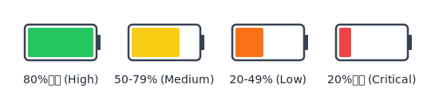
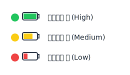
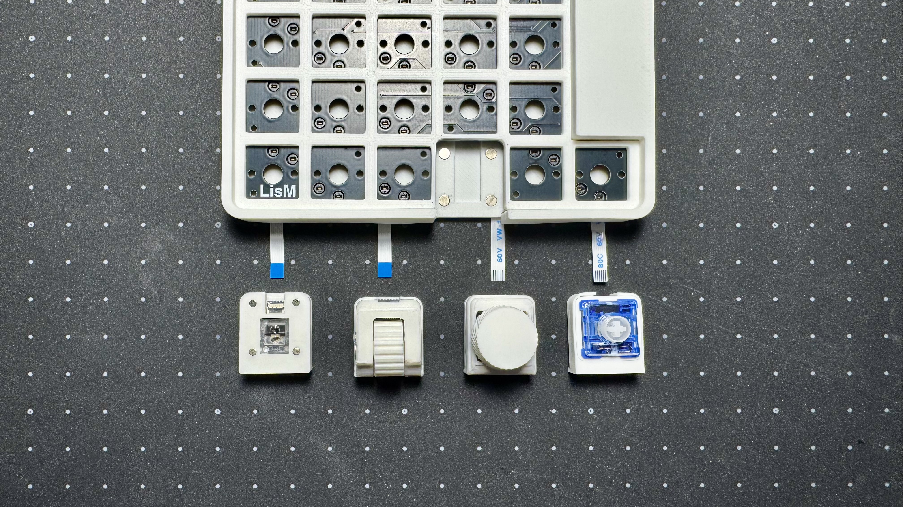

## 電源ON/OFF
キーボードの側面にあるスライドスイッチで電源のON/OFFを切り替えます。 
{width=65%}  
ONにするとLEDインジケーターが点灯し、起動状態を示します。

---

## 充電
電源スイッチをONの状態でUSB接続すると充電されます。  
充電中は電池残量に応じてインジケーターが変化します。  

---

## デバイスへの接続
`LisM`は、Bluetooth（最大5台）でデバイスに接続できます。

### 1台目のデバイスを接続する (Bluetooth)
1.  キーボードの電源をONにします。
2.  接続したいデバイス（PCなど）のBluetooth設定画面を開き、検出された「LisM」を選択してペアリングします。
3.  ペアリングが完了すると、デバイスは自動的に1番目のスロット（`BT_SEL 0`）に登録されます。

### 2台目以降のデバイスを接続する (マルチペアリング)
1.  **キーボードの接続先スロットを切り替える**  
    `BT_SEL 1` など、まだ使われていないスロットに切り替えます。（キーマップで設定したキーを押してください）
2.  **他のデバイスのBluetoothをOFFにする**  
    安定したペアリングのため、すでにLisMと接続済みのデバイス（1台目のPCなど）のBluetoothを一時的にOFFにします。
3.  **新しいデバイスとペアリングする**  
    新しく接続したいデバイス（スマートフォンやタブレットなど）のBluetooth設定画面から「LisM」を選択し、ペアリングします。
4.  **他のデバイスも同様に登録する**  
    この手順を繰り返し、最大5台までデバイスを登録できます。（`BT_SEL 0` 〜 `BT_SEL 4`）

### 接続先を切り替える
一度ペアリングしたデバイス間は、キーマップで設定した `BT_SEL 0` 〜 `BT_SEL 4` のキーを押すだけで、瞬時に接続先を切り替えることができます。

### 登録デバイスの削除
キーマップで設定した `BT_CLR` キーを押すと、現在選択しているスロットのペアリング情報が削除されます。

---

## LEDインジケーター

LisMは[RGBLED Widget](https://github.com/caksoylar/zmk-rgbled-widget)を使用して、キーボードのLEDでバッテリー残量やBluetooth接続状態を視覚的に通知します。  
キーボードの起動時に**電池残量→接続状態の順**で表示されます。

### 電池残量の表示
起動時やバッテリーレベルの変動時に、現在の電池残量をLEDの色で示します。  

### 接続状態の表示
起動時やBluetoothプロファイルの切り替え時に、現在の接続状態をLEDの色で示します。  

---

## リセット
接続がうまくいかない・モジュールが動かない場合などに使用します。

---

## モジュール付け替え

LisMは、用途に応じてモジュールを付け替えることができます。

1.  **電源をOFFにする**  
    安全のため、必ず電源をOFFにしてください。

2.  **FFCケーブルを差し替える**  
    モジュールのコネクタの黒いフリップを上げてケーブルを抜き、付け替えたいモジュールのケーブルを差し込みます。  
    フリップは壊れやすいので、付属のスパッジャーなどを使って慎重に操作してください。

    :::tip[モジュールのFFCの向き]
    以下の画像の向きで接続してください。  

    
    :::

3.  **ファームウェアを書き換える**  
    使用するモジュールの構成に合わせて、適切なファームウェアを書き込む必要があります。  
    詳細は[ファームウェア](./firmware.md)を参照してください。

4.  **電源をONにする**  
    ファームウェアの書き込みが完了したら、電源をONにして動作を確認してください。

---

## キーマップ変更
キーマップの変更方法は、[ファームウェア](../firmware#キーマップの変更方法)のページを参照してください。